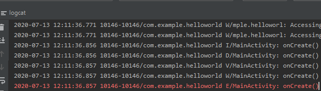
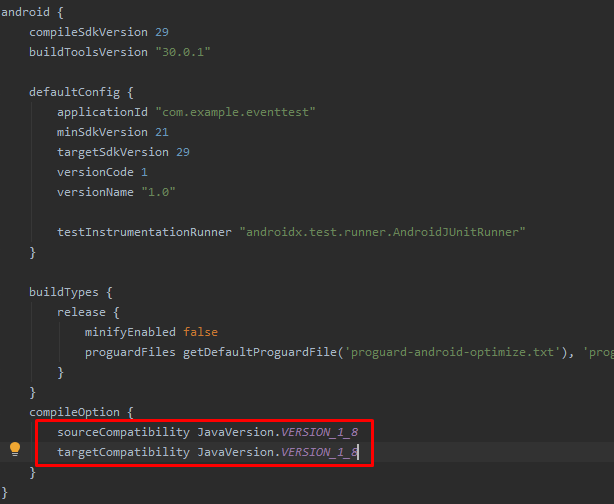

# Android

1. 플랫폼(PDK)
2. NDK
3. SDK


- 개발환경
    
    언어 : Java -->> Kotlin
    개발환경 : Anroid Studio(Open JDK 1.8)

MVC2 pattern 의 View와 Controller를 android studio에서 다룰 수 있다.
View(XML) Contrller(Activity)

---
Shift + f10 을 통한 디버깅

onCreate 가장먼저 호출
```java
protected void onCreate(Bundle savedInstanceState) {
        super.onCreate(savedInstanceState); //부모 매서드의 onCreate호출을 통한 부모 추기화
        setContentView(R.layout.activity_main);
        //Resource.
        //대문자로 되어있는 것은 상수값을 가지고 있다는 것을 의미
    }
```
```xml
# layoutView의 화면을 UI로 표시해주지만
# 종국에는 xml을 수정해야하기 때문에 처음부터 xml로 코딩하자

<?xml version="1.0" encoding="utf-8"?>
<androidx.constraintlayout.widget.ConstraintLayout xmlns:android="http://schemas.android.com/apk/res/android"
    xmlns:app="http://schemas.android.com/apk/res-auto"
    xmlns:tools="http://schemas.android.com/tools"
    android:layout_width="match_parent"
    android:layout_height="match_parent"
    tools:context=".MainActivity">

    <TextView
        android:layout_width="wrap_content"
        android:layout_height="wrap_content"
        android:text="Hello World!"
        android:textSize="30sp" # 안드로이드는 기종에 따라 해상도가 다르기 때문에 pixel단위로 글자크기를 정하면 기종마다 다르게 뜨므로 sp단위를 이용한다
        app:layout_constraintBottom_toBottomOf="parent"
        app:layout_constraintLeft_toLeftOf="parent"
        app:layout_constraintRight_toRightOf="parent"
        app:layout_constraintTop_toTopOf="parent" />

</androidx.constraintlayout.widget.ConstraintLayout>
```

System의 log는 logcat이라는 곳에 모여 찍히기 때문에 따로 log를 위한 매커니즘을 사용하지 않아도된다.

```java
System.out.println("HelloWorld : MainActivity-onCreate()");
```
<br/>
System.out을 검색을 통해 찾은 모습..

```java
private static final String TAG = "MainActivity";

Log.i(TAG, "onCreate()"); //TAG명은 보통 클래스 이름으로 지정
Log.d(TAG, "onCreate()");
Log.v(TAG, "onCreate()");
Log.w(TAG, "onCreate()");
Log.e(TAG, "onCreate()");
```


---

## Layout
textView와 Button등을 붙일 때 쓰는 화면 - Layout


<br/>

orientation = view의 결착방식 설정
```xml
android:orientation="vertical"
```

<br/>
Hello World! 밑으로 내려온 goodbye
```xml
<TextView
        android:layout_width="match_parent"
        android:layout_height="wrap_content"
        android:background="#FFFF0000"
        android:text="Hello World!"
        android:textSize="30sp"
        android:textStyle="bold"/>

    <TextView
        android:layout_width="match_parent"
        android:layout_height="wrap_content"
        android:background="#03A9F4"
        android:text="goodbye"
        android:textSize="30sp"
        android:textStyle="bold"/>
```


```xml
 android:orientation="horizontal"
```
<br/>
수평으로 나열하여서 goodbye가 layout 밖으로 나간모습.

```java
TextView textview = findViewById(R.id.byeTextView);
        textview.setText("hellow, world");
```


---
## Button
<br/>
Button은 textView를 부모로 가지고 있다.

```xml
    <Button
        android:layout_width="match_parent"
        android:layout_height="wrap_content"
        android:text="OK"
        android:textSize= "50sp"/>
    <TextView
        android:layout_width="match_parent"
        android:layout_height="wrap_content"
        android:text="OK"
        android:textSize= "50sp"/>
```


```xml
<Button android:id="@+id/clickButton"
```
```java
protected void onCreate(Bundle savedInstanceState) {
        super.onCreate(savedInstanceState);
        setContentView(R.layout.activity_main);

        Button clickButton = findViewById(R.id.clickButton);
        MyOnClickListener listener = new MyOnClickListener();
        clickButton.setOnClickListener(listener);
        //listener 객체가
    }
}
class MyOnClickListener implements View.OnClickListener {
    @Override
    public void onClick(View view) {
        Log.i(MainActivity.TAG, "Button is Clicked!");
    }
}
```
<br/>
하지만 이러한 방법은 button마다 listener를 만들어 주어야한다.

다른방법
```java
public class MainActivity extends AppCompatActivity implements  View.OnClickListener{
    final static String TAG ="MainActiyivity";
    @Override
    protected void onCreate(Bundle savedInstanceState) {
        super.onCreate(savedInstanceState);
        setContentView(R.layout.activity_main);

        Button clickButton = findViewById(R.id.clickButton);
        MyOnClickListener listener = new MyOnClickListener();
        clickButton.setOnClickListener(listener);
        //listener 객체
        clickButton.setOnClickListener(this);
    }
    public void onClick(View view) {
        Log.i(MainActivity.TAG, "Button is Clicked!");
    }
}
class MyOnClickListener implements View.OnClickListener {
    @Override
    public void onClick(View view) {
        Log.i(MainActivity.TAG, "Button is Clicked!");
    }
}
```
---
그러나 해당방법은 디자인적인 관점에서 좋은방법이 아니다.

```java
public class MainActivity extends AppCompatActivity implements  View.OnClickListener{
    final static String TAG ="MainActiyivity";
    @Override
    protected void onCreate(Bundle savedInstanceState) {
        super.onCreate(savedInstanceState);
        setContentView(R.layout.activity_main);

        Button clickButton = findViewById(R.id.clickButton);
        //MyOnClickListener listener = new MyOnClickListener();
        //clickButton.setOnClickListener(listener);
        //listener 객체
        //clickButton.setOnClickListener(this);
        View.OnClickListener listener = new View.OnClickListener(){
            public void onClick(View view){
                Log.i(MainActivity.TAG, "Button is Clicked!");
            }
        };
        clickButton.setOnClickListener(listener);
    }

    public void onClick(View view) {
        Log.i(MainActivity.TAG, "Button is Clicked!");
    }
}


class MyOnClickListener implements View.OnClickListener {
    @Override
    public void onClick(View view) {
        Log.i(MainActivity.TAG, "Button is Clicked!");
    }
}
```
이제 Listener를 위해 새로운 class를 만들 필요도 없고 재사용성이 높아진다

그러나 여기서만 사용하는 기능을 굳이 함수로 만들어 사용하는것은 자원낭비이다.
```java
clickButton.setOnClickListener(new View.OnClickListener(){
            @Override
            public void onClick(View view) {
                Log.i(MainActivity.TAG, "Button is Clicked!");
            }
        });
```
임시객체사용

해당 코드가 너무길다 -- 람다식으로 교체
```java
clickButton.setOnClickListener(view -> Log.d(TAG, "Button is clicked!"));
```
---
## Gradle
<br/>
build.gradle(Module: app) 추가
<br/>
해당코드 추가.

---

```java
clickButton.setOnClickListener(view -> Log.d(TAG, "button"));
```

android에서는 사용자의 편의를 위해서 버튼에 한해서 xml의 속성을 그대로 이용 할 수 있게 해준다

```java
public class MainActivity extends AppCompatActivity {
    final static String TAG ="MainActiyivity";

    public void onClick(View view) {
        Log.d(TAG, "button is clicked!");
    }
    @Override
    protected void onCreate(Bundle savedInstanceState) {
        super.onCreate(savedInstanceState);
        setContentView(R.layout.activity_main);
    }
}
```

button에 event지정
```java
    public void onClickButton(View view){
        LinearLayout layout = findViewById(R.id.layout);
        layout.setBackgroundColor(Color.RED);
        //버튼을 클릭할 때 layout의 backgroundColor를 바꿔준다.
    }
```
---
event에 따른 분기문 작성가능.
```xml
<Button android:id="@+id/readButton"
    android:layout_width="match_parent"
    android:layout_height="wrap_content"
    android:text="RED"
    android:onClick="onClickButton"
    android:textSize="50sp"/>

<Button android:id="@+id/greenButton"
    android:layout_width="match_parent"
    android:layout_height="wrap_content"
    android:text="GREEN"
    android:onClick="onClickButton"
    android:textSize="50sp"/>
```
```java
public void onClickButton(View view){
    LinearLayout layout = findViewById(R.id.layout);
    switch (view.getId()) {
        case R.id.readButton:
            layout.setBackgroundColor(Color.RED);
            break;
        case R.id.greenButton:
            layout.setBackgroundColor(Color.GREEN);
            break;
    }
}
```
---
### button이 아닌 일반적인 widget에 대해서 event 처리
```java
 protected void onCreate(Bundle savedInstanceState) {
        super.onCreate(savedInstanceState);
        setContentView(R.layout.activity_main);
        TextView textview = findViewById(R.id.textView);
        textview.setOnTouchListener(new View.OnTouchListener() {
            public boolean onTouch(View view, MotionEvent motionEvent) {
                Log.d(TAG, "Textview is Touched");
                return true;
                //호출한 쪽에서 return 값을 보고 event가 다 처리되지 않았다고 판단
                //true - event처리완료 끝
                //false - event처리가 덜 되었으므로 호출한곳에서 해당 event를 처리해준다.
                //event chaining
            }
        });
    }
```
<br/>
touch의 경우 clickButtonDown과 clickButtonUp을 동시에 인식하기 때문에 두번 찍힌다.

```java
protected void onCreate(Bundle savedInstanceState) {
        super.onCreate(savedInstanceState);
        setContentView(R.layout.activity_main);
        TextView textview = findViewById(R.id.textView);
        textview.setOnTouchListener(new View.OnTouchListener() {
            public boolean onTouch(View view, MotionEvent motionEvent) {
                int action = motionEvent.getAction();
                switch (action) {
                    case MotionEvent.ACTION_DOWN:
                        //뷰를 눌렀을 때
                        Log.i(TAG,"DONW");
                        break;
                    case MotionEvent.ACTION_MOVE:
                        Log.i(TAG,"MOVE");
                        //뷰를 누른 상태로 이동
                        break;
                    case MotionEvent.ACTION_UP:
                        Log.i(TAG,"UP");
                        //뷰로부터 떨어졌을 때
                        break;
                }

                return true;
            }
        });
    }
```


chatty 발생 : MOVE는 픽셀상으로 이동하기 때문에 chatty가 발생하는것이 맞다

----
### checkBox
```xml
    <CheckBox android:id="@+id/checkBox"
        android:layout_width="match_parent"
        android:layout_height="wrap_content"
        android:checked="true"
        android:textSize="50sp"
        android:textStyle="bold"
        android:text="구독"/>
```


---
```java
public class MainActivity extends AppCompatActivity {
    final static String TAG = "MainActivity";
    CheckBox checkBox;
    @Override
    protected void onCreate(Bundle savedInstanceState) {
        super.onCreate(savedInstanceState);
        setContentView(R.layout.activity_main);

        checkBox = findViewById(R.id.checkBox);
    }

    public void OnButtonClick(View view) {
        if(checkBox.isChecked()) {
            Log.i(TAG, "checked " + checkBox.getText());
        }
        else {
            Log.i(TAG, "unchecked " + checkBox.getText());
        }
    }
}
```
<br/>
분기문으로 checkbox가 check되어있는지 unchecked 되어있는지 확인한후 
출력해주는 값을 다르게 해주었다.<br/>


---
```xml
 <RadioGroup
        android:layout_width="match_parent"
        android:layout_height="wrap_content"
        android:orientation="vertical" >

        <RadioButton android:id="@+id/MaleRadioButton"
            android:layout_width="match_parent"
            android:layout_height="wrap_content"
            android:textSize="50sp"
            android:textStyle="bold"
            android:text="남자"/>

        <RadioButton android:id="@+id/FemaleRadioButton"
            android:layout_width="match_parent"
            android:layout_height="wrap_content"
            android:textSize="50sp"
            android:textStyle="bold"
            android:text="여자"/>
    </RadioGroup>
```
```java
public class MainActivity extends AppCompatActivity {
    final static String TAG="MainActivity";

    @Override
    protected void onCreate(Bundle savedInstanceState) {
        super.onCreate(savedInstanceState);
        setContentView(R.layout.activity_main);

        RadioButton.OnClickListener listener = new RadioButton.OnClickListener() {
            @Override
            public void onClick(View view) {
                switch (view.getId()) {
                    case R.id.MaleRadioButton:
                        Log.i(TAG, "남자");
                        break;
                    case R.id.FemaleRadioButton:
                        Log.i(TAG, "여자");
                        break;
                }
            }
        };

        RadioButton maleRadioButton = findViewById(R.id.MaleRadioButton);
        RadioButton femaleRadioButton = findViewById(R.id.FemaleRadioButton);
        maleRadioButton.setOnClickListener(listener);
        femaleRadioButton.setOnClickListener(listener);
    }
}
```
<br/>
이러한 경우 남자의 radiobutton을 설정해두면 남자를 설정하고 또다시 남자를 클릭하면 계속해서 해당 radio의 정보를 읽어온다.

이러한 경우 radiogroup으로 event를 걸어주어야한다.

---
```java
RadioGroup group = findViewById(R.id.radioGroup);
        group.setOnCheckedChangeListener(new RadioGroup.OnCheckedChangeListener() {
            @Override
            public void onCheckedChanged(RadioGroup radioGroup, int id) {
                switch (id) {
                    case R.id.MaleRadioButton:
                        Log.i(TAG, "남자");
                        break;
                    case R.id.FemaleRadioButton:
                        Log.i(TAG, "여자");
                        break;
                }
            }
        });
```


---

## Edit Text(View)

```java
public class MainActivity extends AppCompatActivity {
    final static String TAG="MainActivity";
    EditText minputEditText;

    @Override
    protected void onCreate(Bundle savedInstanceState) {
        super.onCreate(savedInstanceState);
        setContentView(R.layout.activity_main);

        minputEditText = findViewById(R.id.inputEditText);
    }

    public void onButtonClick(View view) {
        String inputString = minputEditText.getText().toString();
        if(!inputString.isEmpty())
        Log.i(TAG, inputString);
    }
}
```
```xml
<EditText android:id="@+id/inputEditText"
        android:layout_width="match_parent"
        android:layout_height="wrap_content"
        android:textSize="50sp"
        android:textColor="#FF000000"/>

<Button android:id="@+id/logButton"
    android:layout_width="match_parent"
    android:layout_height="wrap_content"
    android:textSize="50sp"
    android:text="LOG"
    android:onClick="onButtonClick"
    android:textColor="#FF000000"/>
```