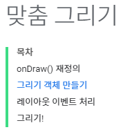

# EditText

## TextWatcher
`EditText` 내부의 값의 변경 여부에 따라서 실행되는 함수
```java
 mEditText.addTextChangedListener(new TextWatcher() {
            @Override
            public void beforeTextChanged(CharSequence charSequence, int i, int i1, int i2) {
                //내용이 변경되기 전에 호출되는 메서드
            }

            @Override
            public void onTextChanged(CharSequence charSequence, int i, int i1, int i2) {
                //내용이 변경될 때 호출되는 메서드
            }

            @Override
            public void afterTextChanged(Editable editable) {
                //내용이 변경된 후 호출되는 메서드
            }
        });
```
    입력 직전 : beforeTextChanged
    입력 되었을 때 : onTextChanged
    입력 후 : afterTextChanged

제공되는 위의 함수를 이용해서 필터링을 줄수 있지만
`EditText`자체적으로 제공하는 `inputType`을 통해 softkeyboard의 
타입과 형식을 바꿀 수 있다.
```xml
<EditText android:id="@+id/editText"
        android:layout_width="match_parent"
        android:layout_height="wrap_content"
        android:textSize="50sp"
        android:textColor="#FF00"
        android:inputType="number"
        number만 칠수 있는 keyboardInputType설정

        android:hint="input number"
        jsp의 holder와 같다 회색의 얕은 색으로 text가 나오며커서를 올려두면 사라지고 사용자의 입력을 받는다. 

        android:singleLine="true"
        EditText내에서 개행을 받지 않는다.
        

        android:maxLines="3"
        개행을 3line만 주겠다.

        singleLine과 maxLines를 같이 쓰는 이유
        사용자가 사용하는 line수 제한.

        android:digits="ABCDEF"
        사용자가 입력할 수 있는 문자사용 제한.
         />
```

---

간단 tweet만들기
```java
    private static String TAG="MainActivity";
    private TextView mCountTextView;
    private EditText mInputEditText;

    @Override
    protected void onCreate(Bundle savedInstanceState) {
        super.onCreate(savedInstanceState);
        setContentView(R.layout.activity_main);

        mCountTextView = findViewById(R.id.count_textView);
        mInputEditText = findViewById(R.id.input_editText);

        mInputEditText.addTextChangedListener(new TextWatcher() {
            @Override
            public void beforeTextChanged(CharSequence charSequence, int i, int i1, int i2) {

            }

            @Override
            public void onTextChanged(CharSequence charSequence, int i, int i1, int i2) {

            }

            @Override
            public void afterTextChanged(Editable editable) {
                int count = editable.length();
                mCountTextView.setText(String.format("%d / 10", count));
            }
        });
    }
```
```xml
    <TextView
        android:id="@+id/count_textView"
        android:layout_width="match_parent"
        android:layout_height="wrap_content"
        android:textSize="50sp"
        android:textColor="#FF000000"
        android:text="0 / 10"
        android:textStyle="bold"
        android:gravity="right"
        />
    <EditText android:id="@+id/input_editText"
        android:layout_width="match_parent"
        android:layout_height="wrap_content"
        android:singleLine="true"
        android:textSize="50sp"
        android:textColor="#FF000000"
        android:hint="0~9"
        android:textStyle="bold"
        android:maxLength="10"/>
```


---
## CustomView
사용자 customView를 사용하려면 `View` 를 상속받아야한다.


```java
//customView 는 반드시 View를 상속하여야한다.

public class MyView extends View {
    //customView는 부모클래스의 생성자를 호출하여야한다
    public MyView(Context context) {
        //부모클래스에 반드시 컨텍스트 객체를 전달해야 한다
        super(context);
    }
}

```
---
### context


생성된 `View`객체를 `MainActivity`에 전달하여 사용한 모습
```java
public MyView(Context context) {
        //부모클래스에 반드시 컨텍스트 객체를 전달해야 한다
        super(context);

        mPaint = new Paint();
        mPaint.setColor(Color.RED);
    }

    //customView는 반드시 onDraw 매서드를 오버라이딩해야한다
    //화면에 그려지는 객체들은 모두 자신이 어떻게 그려져야 할 지를
    //알고 있다 이에 대한 정보는 onDraw에 정의되어 있다.
    @Override
    protected void onDraw(Canvas canvas) {
        super.onDraw(canvas);

        //캔버스에는 다양한 그리기 알고리즘이 제공된다.
        canvas.drawRect(100,100,500,500, mPaint);
    }
```
```java
protected void onCreate(Bundle savedInstanceState) {
        super.onCreate(savedInstanceState);
        ///setContentView(R.layout.activity_main);

        //customview를 실행화면에 붙인 모습
        MyView myview = new MyView(this);
        setContentView(myview);
    }
```
---

생성한 `MyView`를 XML에 직접 보내어 사용.

```java
public MyView(Context context, AttributeSet attrs) {
        super(context, attrs);

        mPaint = new Paint();
        mPaint.setColor(Color.RED);
    }
```
```xml
CustomView의 위치를 그대로 가져와서 사용.
<com.example.paintapp.MyView
        android:layout_width="wrap_content"
        android:layout_height="wrap_content"
        android:text="Hello World!" />
```


---

```java
 //MyView에서의 Event처리

    @Override
    public boolean onTouchEvent(MotionEvent event) {
        //Log.i(TAG, "touched");
        if(event.getAction() == MotionEvent.ACTION_DOWN) {
            mIndex = (mIndex + 1)% mColor.length;
            mPaint.setColor(mColor[mIndex]);

            return true;
        }
        return super.onTouchEvent(event);
    }
```
하지만 해당의 `MyView event`는 처리되지않는다.
`MyView`는 `MainActivity`의 `View`에 의해서 무효화가 되었다 (가려졌다)
`MyView`를 활성화 해주기위해서 다시 그려주어야한다.

```java
   invalidate(); //View를 다시 그리기 위해 onDraw 매서드를 호출
                          //그러나 사용자가 onDraw를 직접적으로 호출하면안되고
                          //안드로이드가 호출하게 해야한다.
                          //해당함수는 안드로이드 다시 호출하는 구문.
```
---

### Canvas가 제공하는 그리기 기능



---
`private Paint mPaint;` : `Paint`로 만들어진 변수
```java
protected void onDraw(Canvas canvas) {
        //이 매서드는 안드로이드에 의해 자동으로 콜백된다.
        super.onDraw(canvas);

        //캔버스에는 다양한 그리기 알고리즘이 제공된다.
        canvas.drawRect(100,100,500,500, mPaint);
    }
```
`mPaint.setStyle(Paint.Style.FILL);` : 도형을 해당 속성으로 채우기( 기본값 )
`mPaint.setStyle(Paint.Style.STROKE);` : 외곽선만 그리기
`mPaint.setStrokeWidth(10.0F);` : 외곽선의 두께 지정
`mPaint.setAntiAlias(true);` : 추가 anti설정
`canvas.drawText("hello, world", 50, 300, mPaint);` : 문자 출력

    문자에도 paint 옵션설정이 적용된다.

`canvas.drawLine(20, 20, 500, 500, mPaint);` : 선그리기

> 참고 링크 : https://developer.android.com/training/custom-views/custom-drawing#java

---
### onTouch Event(좌표정보받기)
곡선을 그릴때 사용
`Touch`의 시작점을 받고 그 다음의 좌표를 받아 연결한다.


```java
public boolean onTouchEvent(MotionEvent event) {
        float x =event.getX();
        float y = event.getY();
        switch (event.getAction()) {
            case MotionEvent.ACTION_DOWN:
                Log.i(TAG, String.format("DOWN(%f %f)", x ,y ));
                return true;
            case MotionEvent.ACTION_MOVE:
                Log.i(TAG, String.format("MOVE(%f %f)", x ,y ));
                return true;
            case MotionEvent.ACTION_UP:
                Log.i(TAG, String.format("UP(%f %f)", x ,y ));
                return true;
        }
        return super.onTouchEvent(event);
    }
```


부동소수점 까지 다 찍히지만 세세한 정보값 까지 받을 필요도없고
받아서 하게되면 코드가 복잡해진다.

---

- `onTouchEvent`를 이용하여 그림판만들기
```java
protected void onDraw(Canvas canvas) {
        super.onDraw(canvas);
        //canvas.drawLine(mStartX, mStartY, mStopX, mStopY, mPaint);
        canvas.drawPath(mPath, mPaint);
}


public boolean onTouchEvent(MotionEvent event) {
    switch (event.getAction()) {
        case MotionEvent.ACTION_DOWN:
            mStartX = event.getX();
            mStartY = event.getY();
            //touch가 시작할 좌표
            return true;

        case MotionEvent.ACTION_MOVE: //MOVE와 UP은 끝나는 좌표가 같으므로
        case MotionEvent.ACTION_UP:
            mPath.moveTo(mStartX, mStartY);// 시작점의 위치로 이동.

            mStopX = event.getX();
            mStopY = event.getY();

            mPath.lineTo(mStopX, mStopY); //끝점의 위치 설정
            invalidate(); // 비동기적 호출로 인하여 저장되기 전에 꺼내진다.

            mStartX = mStopX;
            mStartY = mStopY;
            //touch가 끝나는 좌표
            return true;
    }
    return super.onTouchEvent(event);
}
```


---

### List View

하나이상의 ItemView를 포함하는 `ViewList`

`ListView`와 `Data`가 저장되어있는 `Linaer container` 사이를 연결해주는 `Adaptor`객체가 필요하다.

`List View`를 쓰기 위해서는
`ListView`, `container`, `Adaptor` 가 필요하다.


---

list 생성
```java
names.add("Daniel");
names.add("Susan");
names.add("Andrew");
names.add("Monica");
names.add("Joshep");
names.add("Choi");
```
`itemList`를 설정할 `layout` 새로만들기
```xml
<?xml version="1.0" encoding="utf-8"?>
<TextView android:id="@+id/list_item"
    xmlns:tools="http://schemas.android.com/tools"
    xmlns:android="http://schemas.android.com/apk/res/android"
    android:layout_width="match_parent"
    andro
    id:layout_height="match_parent"
    android:textSize="50sp"
    android:textColor="#FF000000"/>
```
`ViewList`와 연결
```java
//adapter생성
ArrayAdapter<String> adapter = new ArrayAdapter<>(this, R.layout.list_item, names);


//어댑터를 리스트 뷰에 연동
ListView listView = findViewById(R.id.name_listView);
listView.setAdapter(adapter);
``` 


---
`android:layout_height="0dp"` 
`android:layout_weight="1"`

EditText를 침범하지않게 ListView의 height설정


`textWatcher`는 특정키에 대한 이벤트 보다는 입력되는 문자열에 대한 변화에 대해서 인식할 때 사용에 용이하기 때문에 특정키에 대한 이벤트 설정은 `textWatcher`보다는 `Listener`를 이용한다
```java
mTodoEditText.setOnKeyListener(new View.OnKeyListener() {
            //특정키를 받기위한 매서드
            @Override
            public boolean onKey(View view, int keyCode, KeyEvent keyEvent) {
                //각 키에대한 값을 enumertaion으로 있기때문에 비교를 해주면 된다

                //엔터를 눌렀을 때에 대한 처리
                if(keyCode == KeyEvent.KEYCODE_ENTER) {
                    //아무것도 입력하지 않았을 때 Enter키 입력에 대한 분기문 설정
                    String todo =mTodoEditText.getText().toString();
                    if(!todo.isEmpty()) {
                        mTodoDataSet.add(0, todo);//제일 첫번째 줄에 추가하고
                        //중요
                        mListAdaptor.notifyDataSetChanged();//리스트뷰 갱신.
                                                            //해당 함수를 써주지않으면 listView가 갱신되지 못한다.
                        //중요
                        mTodoEditText.setText(null); //TextView 비우기
                        return true;
                    }
                }
                return false;
            }
        });
```


---
```java
mListView.setOnItemLongClickListener(new AdapterView.OnItemLongClickListener() {
            //mListView에 대해서 LongClick동안의 touch가 있었을 때 실행되는 event 설정.
            @Override
            public boolean onItemLongClick(AdapterView<?> adapterView, View view, int position, long id) {
                                        //AdapterView = mListView,
                                        //View =
                mTodoDataSet.remove(position);
                mListAdaptor.notifyDataSetChanged();
                return true;
            }
        });
```
해당하는 position의 item을 remove하고 ListView 갱신

---