# Message System

## Toast Message
`Toast.makeText(this, "hellow World", Toast.LENGTH_LONG).show();`
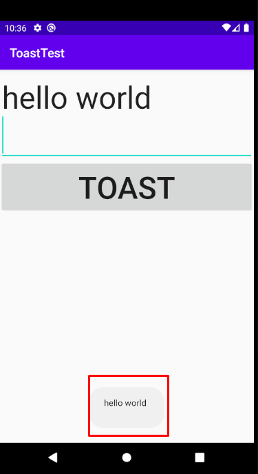

---
## SnackBar Message
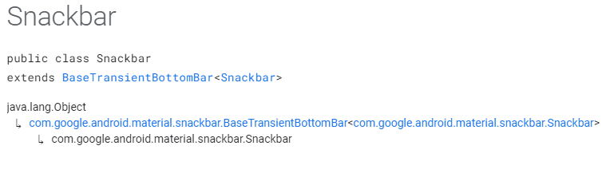


`Gradle`
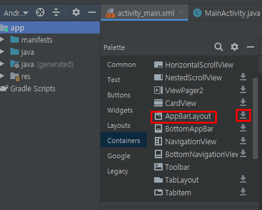


`추가된 Meterial`
```xml
dependencies {
    implementation fileTree(dir: "libs", include: ["*.jar"])
    implementation 'androidx.appcompat:appcompat:1.1.0'
    implementation 'androidx.constraintlayout:constraintlayout:1.1.3'
    implementation 'com.google.android.material:material:1.0.0'
    testImplementation 'junit:junit:4.12'
    androidTestImplementation 'androidx.test.ext:junit:1.1.1'
    androidTestImplementation 'androidx.test.espresso:espresso-core:3.2.0'

}
```
`Toast`는 `View`와 상관없이 제일 상위에 뜨기 때문에 `context`만 있으면 되지만
`Snackbar`는 `rootView`가 필요하다.
`LinearLayout`에 대한 `onButtonClick`의 `View`
` - Snackbar.make(view, "hello World", Snackbar.LENGTH_LONG).show()`

`LinearLayout`에 직접적으로 넣은 코드
` - Snackbar.make(layout, "hello World", Snackbar.LENGTH_LONG).show();`


최종초드
```java
public void onButtonClick(View view){
        switch(view.getId()) {
            case R.id.toast_button:
                Toast.makeText(this, "hellow World", Toast.LENGTH_LONG).show();
                break;
            case R.id.snackBar_button:
                Snackbar.make(view, "hello World", Snackbar.LENGTH_LONG).show();
                break;
        };
    }
```
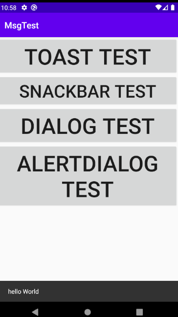


`Snackbar.make(layout, "hello World", Snackbar.LENGTH_INDEFINITE).show();`
Snackbar.LENGTH_INDEFINITE는 이벤트 처리를 위한 옵션이다
```java
Snackbar snackbar = Snackbar.make(layout, "hello World", Snackbar.LENGTH_INDEFINITE);
                snackbar.setAction("OK", new View.OnClickListener() {
                    @Override
                    public void onClick(View view) {
                        Log.i(TAG, "Snackbar Test");
                    }
                });
                snackbar.show();
```
>OK를 누르면 Snackbar가 내려간다.
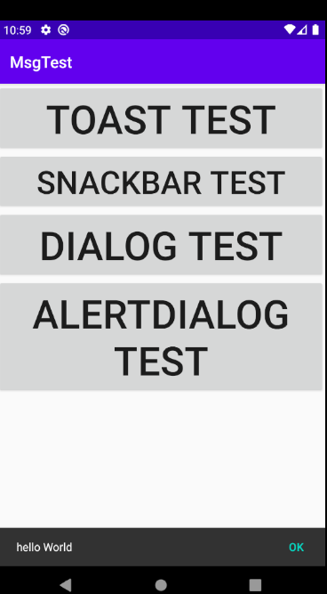
<br/>


Snackbar에 Color 지정
```java
View v = snackbar.getView();
v.setBackgroundColor(Color.BLUE);//backgroundColor
snackbar.setActionTextColor(Color.RED);//INDEFINITE EVENT Text에 대한 Color 지정
```
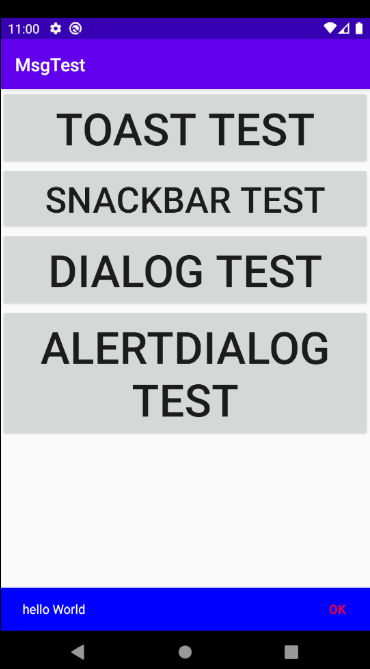

---
## Dialog Message
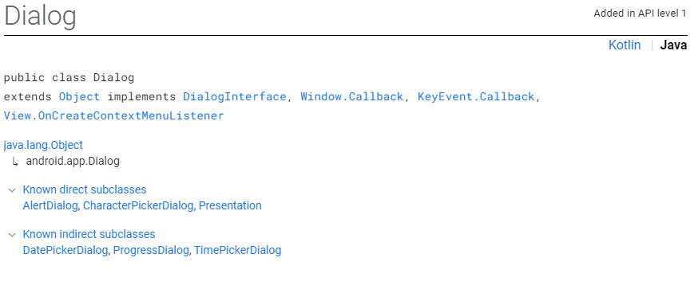
```java
case R.id.dialog_button:
    Dialog dialog = new Dialog(this);
    dialog.show();
    break;
```


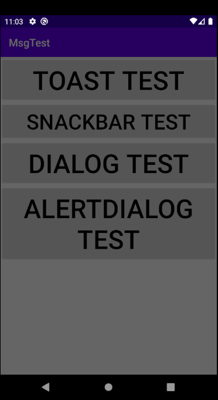<br/>
Dialog는 기본적으로 background만 제공한다.
```java
case R.id.dialog_button:
    Dialog dialog = new Dialog(this);
    TextView tv = new TextView(this);
    tv.setText("Hello world");
    dialog.setContentView(tv);
    dialog.show();
    break;
```
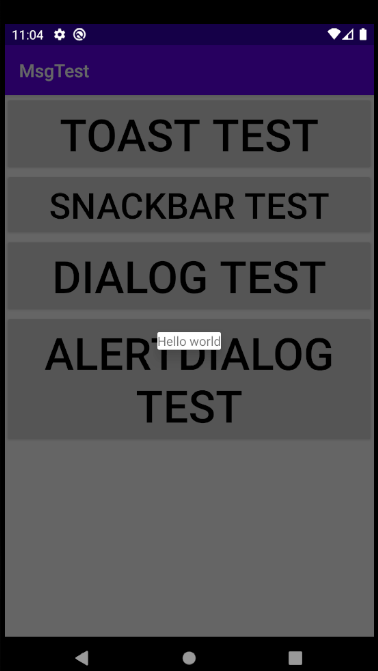

내부 `Text`에 대해서 디자인 설정을 해보자

---
내부 `Text`에 대한 UI 설정
`Layout` 생성
```xml
<?xml version="1.0" encoding="utf-8"?>
<LinearLayout xmlns:android="http://schemas.android.com/apk/res/android"
    android:id="@+id/dialog_layout"
    android:orientation="vertical"
    android:layout_width="match_parent"
    android:layout_height="match_parent">

    <ImageView
        android:id="@+id/dialog_imageView"
        android:layout_width="wrap_content"
        android:layout_height="wrap_content" />

    <TextView
        android:id="@+id/dialog_textView"
        android:layout_width="wrap_content"
        android:layout_height="wrap_content"
        android:textSize="40sp"
        android:textColor="#FF000000"/>
</LinearLayout>
```
```java
Dialog dialog = new Dialog(this);

//전개자(Inflater)로 XML파일 전개하기
LayoutInflater inflater = LayoutInflater.from(this);
LinearLayout layout1 = (LinearLayout)inflater.inflate(R.layout.dialog, null);
break;
```
전체코드
```java
case R.id.dialog_button:
//                Dialog dialog = new Dialog(this);
//                TextView tv = new TextView(this);
//                tv.setText("Hello world");
//                dialog.setContentView(tv);
//                dialog.show();
                Dialog dialog = new Dialog(this);

                //전개자(Inflater)로 XML파일 전개하기
                LayoutInflater inflater = LayoutInflater.from(this);
                LinearLayout layout1 = (LinearLayout)inflater.inflate(R.layout.dialog, null);

                ImageView imageView = layout1.findViewById(R.id.dialog_imageView);
                TextView textView = layout1.findViewById(R.id.dialog_textView);

                imageView.setImageResource(R.mipmap.ic_launcher);
                //== (XML) android:src="@mipmap/ic_launcher"

                textView.setText("대화상자를 열었습니다.");

                dialog.setContentView(layout1);
                dialog.show();
                break;
```
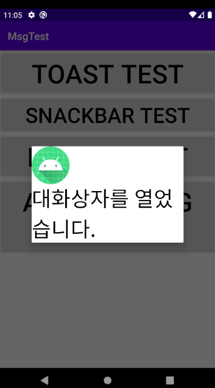

이렇게 `User`가 직접 만들어서 사용할 수 있다.

또한 Android 자체적으로 제공해주는 UI가 있다.

---

### Dialog Builder
Android가 제공하는 Dialog API를 사용하기 위한 Builder 생성<br/>
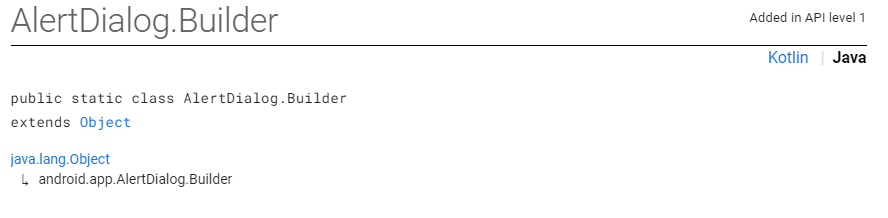
```java
case R.id.alertDialog_button:
    AlertDialog.Builder builder = new AlertDialog.Builder(this);
    builder.setTitle("다이얼로그 테스트");
    builder.setMessage("Hello World");
    builder.setIcon(android.R.drawable.ic_dialog_alert);
    //android가 제공하는 기본 icon

    //Builder pattern을 이용한 AlertDialog 생성
    AlertDialog dlg = builder.create();
    dlg.show();
    break;
```
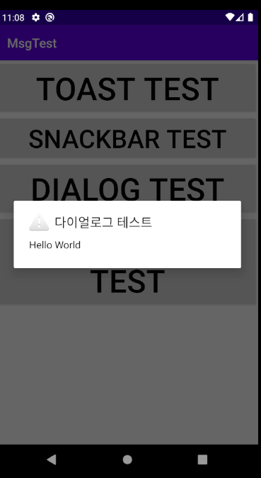

<br/>
- Dialog에 사용자응답버튼 생성

```java
//긍정
builder.setPositiveButton("예", new DialogInterface.OnClickListener() {
    @Override
    public void onClick(DialogInterface dialogInterface, int i) {
        mTextView.setText("'예' 버튼 클릭");
    }
});

//부정
builder.setNegativeButton("아니오", new DialogInterface.OnClickListener() {
    @Override
    public void onClick(DialogInterface dialogInterface, int i) {
        mTextView.setText("'아니오' 버튼 클릭");
    }
});

//중립
builder.setNeutralButton("취소", new DialogInterface.OnClickListener() {
    @Override
    public void onClick(DialogInterface dialogInterface, int i) {
        mTextView.setText("'취소' 버튼 클릭");
    }
});
```
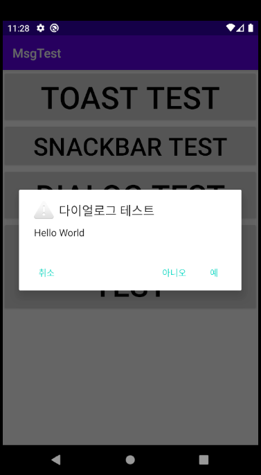

---

전체코드
```java
case R.id.alertDialog_button:
    AlertDialog.Builder builder = new AlertDialog.Builder(this);
    builder.setTitle("다이얼로그 테스트");
    builder.setMessage("Hello World");
    builder.setIcon(android.R.drawable.ic_dialog_alert);
    //android가 제공하는 기본 icon

    builder.setPositiveButton("예", new DialogInterface.OnClickListener() {
        @Override
        public void onClick(DialogInterface dialogInterface, int i) {
            mTextView.setText("'예' 버튼 클릭");
        }
    });
    builder.setNegativeButton("아니오", new DialogInterface.OnClickListener() {
        @Override
        public void onClick(DialogInterface dialogInterface, int i) {
            mTextView.setText("'아니오' 버튼 클릭");
        }
    });
    builder.setNeutralButton("취소", new DialogInterface.OnClickListener() {
        @Override
        public void onClick(DialogInterface dialogInterface, int i) {
            mTextView.setText("'취소' 버튼 클릭");
        }
    });

    //Builder pattern을 이용한 AlertDialog 생성
    AlertDialog dlg = builder.create();
    dlg.show();
    break;
};
```

---

# Activity Communication
어플 사용 중 다른 어플의 기능을 구동할 때 기존어플에서 새로이 어플을 실행했다.

하지만 해당 어플의 `Activity` 만 생성하여 실행한다면 어플이 따로 실행될 일이 없다.

`Second Activity Create -`
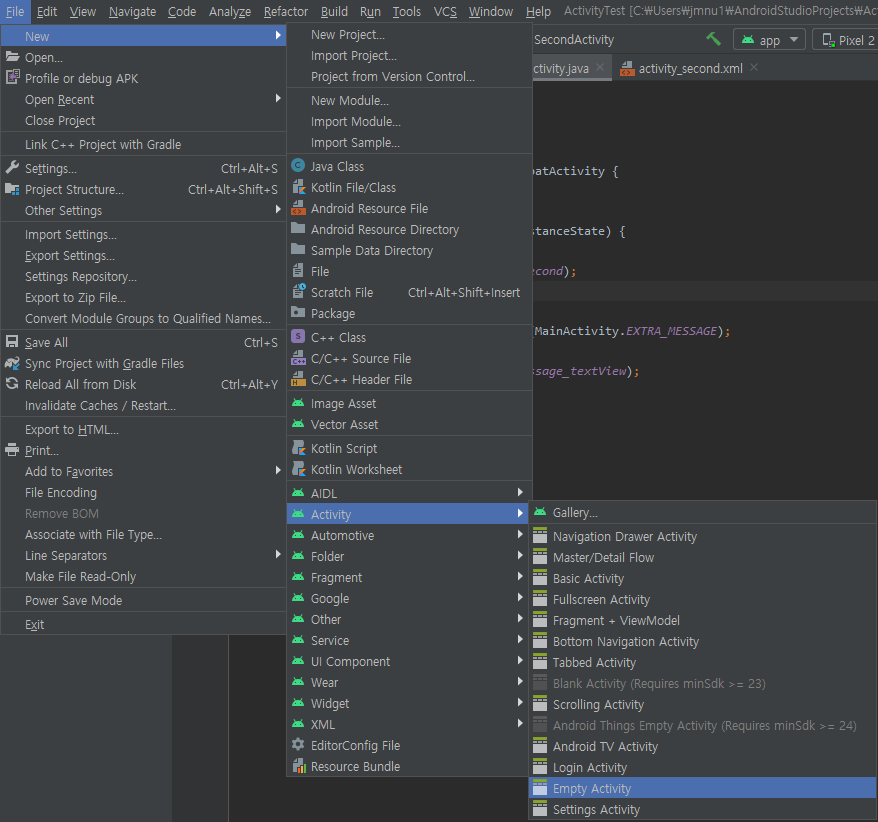
```xml
<?xml version="1.0" encoding="utf-8"?>
<LinearLayout xmlns:android="http://schemas.android.com/apk/res/android"
    xmlns:tools="http://schemas.android.com/tools"
    android:layout_width="match_parent"
    android:layout_height="match_parent"
    tools:context=".SecondActivity">

    <TextView
        android:layout_width="match_parent"
        android:layout_height="wrap_content"
        android:text="SecondActivity"
        android:textSize="40sp"/>
</LinearLayout>
```
`MainActivity Script`
```java
public void onButtonClick(View view){
    Intent intent = new Intent(this, SecondActivity.class);
    startActivity(intent);
}
```

- Intent<br/>
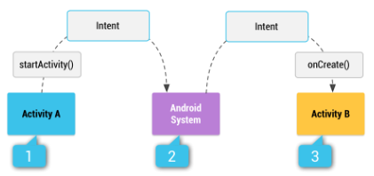
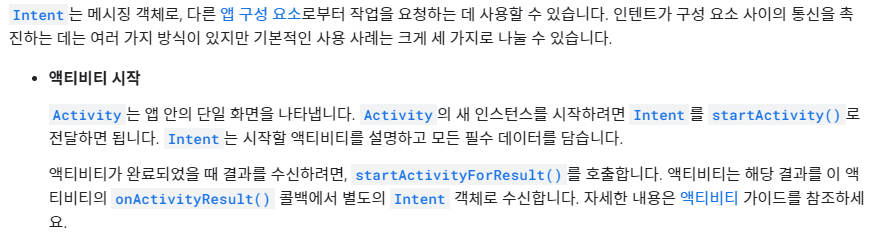


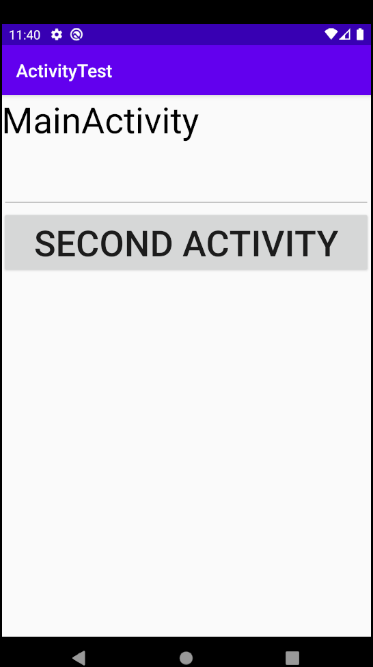
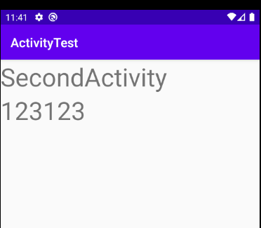<br/>
`intent`는 내부 `Extra`의 `Hashmap`에 데이터를 저장한다.
`intent`를 통한 `ActivityResult` 받기


`onMainActivity -`

```java
public final static String EXTRA_MESSAGE = "com.example.activitytest.mainactivity.MESSAGE";
//다른 Activity에서 참조가능하게 하기위해 공개키 생성
public void onButtonClick(View view){
//        Intent intent = new Intent(this, SecondActivity.class);
//        startActivity(intent);
    String msg = mInputEditText.getText().toString();
    if(!msg.isEmpty()) {
        Intent intent = new Intent(this, SecondActivity.class);
        intent.putExtra(EXTRA_MESSAGE, msg);
        //공개키로 Extra에 데이터 생성
        startActivity(intent);
    }
}
```
`onSecondActivity -`
```java
protected void onCreate(Bundle savedInstanceState) {
    super.onCreate(savedInstanceState);
    setContentView(R.layout.activity_second);
    
    Intent intent = getIntent();
    String msg = intent.getStringExtra(MainActivity.EXTRA_MESSAGE);
    //MainActivity에서 공개키로 만들어진 데이터 가져오기
    TextView tv = findViewById(R.id.message_textView);
    tv.setText(msg);
}
```


---
## Activity간의 Send

`MainActivity`와 `SecondActivity`간의 값 Send


`MainActivity - Send number to SquareActivity`
```java
public void onButtonClick(View view){
        String strNumber = mNumberEditText.getText().toString();
        if(!strNumber.isEmpty()) {
            int number = Integer.parseInt(strNumber);

            Intent intent = new Intent(this, SquareActivity.class);
            intent.putExtra(EXTRA_NUMBER, number);

            //
            startActivityForResult(intent, SQUARE_ACTIVITY);
        }
    }
```

`SquareActivity - Get number in Extra`
```java
protected void onCreate(Bundle savedInstanceState) {
    super.onCreate(savedInstanceState);
    setContentView(R.layout.activity_square);
    Intent intent = getIntent(); // Intent를 받아온다
    number = intent.getIntExtra(MainActivity.EXTRA_NUMBER, 0);
    //해당하는 key가 없으면 두번째 인자인 default값을 return 한다.

    TextView tv = findViewById(R.id.number_textView);
    tv.setText(number+""); // MainActivity로 부터 전달된 값으로 set
}
```
`SquareActivity - Send Result to MainActivity`
```java
 public void onButtonClick(View view){
    switch(view.getId()) {
        case R.id.square_button:
            Intent intent = new Intent(); //결과값 반환 용
            intent.putExtra(EXTRA_RESULT, number * number);
            setResult(RESULT_OK, intent); //OverloadingMethod
            finish(); // 액티비티 종료
            break;
        case R.id.cancel_button:
            setResult(RESULT_CANCELED);
            finish();
            break;
    }
}
```

`MainActivity - Get Result send by SquareActivity`
```java
protected void onActivityResult(int requestCode, int resultCode, @Nullable Intent data) {
    //resultCode는 상대 activity가 보낸 code
    //여러개의 activity가 호출될 때
    if(requestCode == SQUARE_ACTIVITY) { //무슨 ACTIVITY 인지
        if(resultCode == RESULT_OK) { //RESULT_OK
            int result = data.getIntExtra(SquareActivity.EXTRA_RESULT, 0);
            mResultTextView.setText(result +"");
        }
        else { //RESULT_CANCEL
            mResultTextView.setText("취소됨");
        }
    }
    super.onActivityResult(requestCode, resultCode, data);
}
```


---
# Activity LifeCycle

기본적으로 android는 activity를 종료하지 않지만
`onPause()`나 `onStop()`인 상태의 `activity`에 한해서 
android 시스템의 리소스가 부족할 때 해당 상태의 `activity`가 종료된다
```java
@Override
    protected void onStart() {
        super.onStart();
        Log.i(TAG, "onStart()");
    }

    @Override
    protected void onResume() {
        super.onResume();
        Log.i(TAG, "onResume()");
    }

    @Override
    protected void onPause() {
        super.onPause();
        Log.i(TAG, "onPause()");

    }

    @Override
    protected void onStop() {
        super.onStop();
        Log.i(TAG, "onStop()");
    }

    @Override
    protected void onDestroy() {
        super.onDestroy();
        Log.i(TAG, "onDestroy()");
    }
```


drawLine의 View 생성
```java
class MyView extends View {
        Paint mPaint = new Paint();

        public MyView(Context context) {
            super(context);
            mPaint.setStrokeWidth(10);
            mPaint.setAntiAlias(true);
            mPaint.setColor(Color.RED);
        }

        @Override
        protected void onDraw(Canvas canvas) {
            super.onDraw(canvas);
            for (int i =0 ; i < mPoints.size(); i++) {
                if(mPoints.get(i).needToDraw) {
                    canvas.drawLine(mPoints.get(i-1).x, mPoints.get(i-1).y,
                            mPoints.get(i).x, mPoints.get(i).y, mPaint);
                }
            }
        }

        @Override
        public boolean onTouchEvent(MotionEvent event) {
            switch (event.getAction()) {
                case MotionEvent.ACTION_DOWN:
                    mPoints.add(new Point(event.getX(), event.getY(), false));
                    return true;
                case MotionEvent.ACTION_MOVE:
                case MotionEvent.ACTION_UP:
                    mPoints.add(new Point(event.getX(), event.getY(), true));
                    invalidate();
                    return false;
            }
            return super.onTouchEvent(event);
        }
    }

    class Point {
        float x, y;
        boolean needToDraw;

        public Point(float x, float y, boolean needToDraw) {
            this.x = x;
            this.y = y;
            this.needToDraw = needToDraw;
        }
    }
```
---
## InstanceState
Screen Rotation 시 View를 Stop하고 Destory를 하기 때문에
어딘가에 저장해 두어야한다.


Bundle을 이용하여 상태정보를 저장<br/>

```java
ArrayList<Point> mPoints = new ArrayList<>();
```

```java
@Override
    protected void onSaveInstanceState(@NonNull Bundle outState) {
        Log.i(TAG, "onSaveInstanceState");
        outState.putSerializable("mPoints", mPoints);
        super.onSaveInstanceState(outState);
    }

    //복원
    @Override
    protected void onRestoreInstanceState(@NonNull Bundle savedInstanceState) {
        //해당 argument는 절대 null이 될 수 없다.
        ArrayList<Point> points = (ArrayList<Point>) savedInstanceState.getSerializable("mPoints");
        mPoints = points;
        super.onRestoreInstanceState(savedInstanceState);
    }
```
세로모드에서 가로모드로 전환해도 세로모드의 onDraw정보를 다시 불러오는 모습

