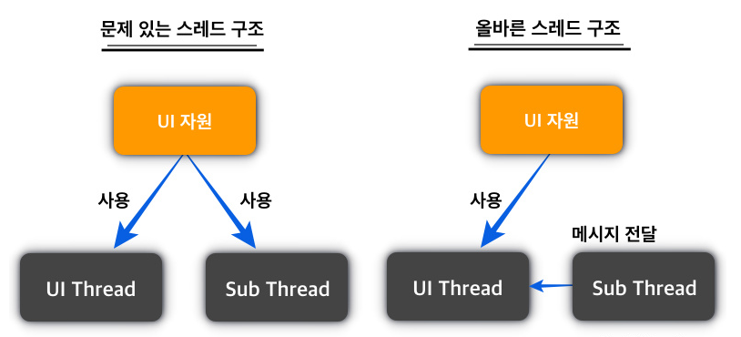
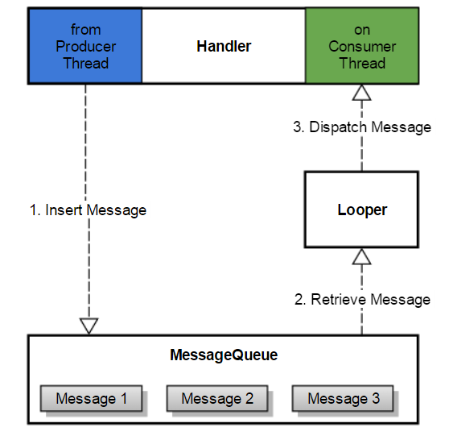

# UI Thread Update

```java
private Handler mHandler = new Handler(Looper.getMainLooper()/*MainThread의 Loop*/);
private int mPercentage;
```
```java
 mThread = new Thread(new Runnable() {
    @Override
    public void run() {
        mButton.setText("Download");
        //WorkerThread가 UI에 관여하는게 아니라 UI
        mProgressBar.setProgress(0);
        for (int i = 0; i <= 100; i++) {
            try { Thread.sleep(100); } catch (InterruptedException e) { e.printStackTrace(); }


            //WorkerThread의 코드 중 일부를 
            // MainThread와 연결되어 있는 UI Thread로 보내어 직접 수행하게 만든다.
            mPercentage = i;
            mHandler.post(new Runnable() {//실제 UI에서 실행할 코드를 가져온다. 즉 여기는 UITHREAD
                @Override
                public void run() {
                    //UI를 대신 UPDATE
                    mButton.setText(mPercentage + "%");
                    mProgressBar.setProgress(mPercentage);
                }
            });
        }
        mThread= null;
    }
});
mThread.start();
```
Android에서 간단하게 `UI Thread`에 한해서 핸들러 없이 바로 메세지 큐에`Runnable` 객체를 보내는 메서드를 제공한다.

`RunOnUiThread`를 제공
```java
 runOnUiThread(new Runnable() {//실제 UI에서 실행할 코드를 가져온다. 즉 여기는 UITHREAD
    @Override
    public void run() {
        //UI를 대신 UPDATE
        mButton.setText(mPercentage + "%");
        mProgressBar.setProgress(mPercentage);
    }
});
```
`(Reactive Programinng)RxJava`를 이용하여 비동기로 처리하는 방식도 있다.

---

TLS(Thread Local Storage)
`Looper`는 Thread단위의 Singleton으로 구성되어 있다.

---
# Looper


`MainThread - `
```java
public void onButtonClick(View view){
        String stringNumber = mNumberEditText.getText().toString();
        //SQUARE하기 위해 입력값을 받아온다.
        if(stringNumber.isEmpty()) {
           return;
        }

        //받은 데이터를 integer로 parse하고
        int number = Integer.parseInt(stringNumber);

        //Message Que instance
        Message msg = Message.obtain();
        //Message Que에 집어 넣는다.
        msg.arg1 = number;

        //최종적으로 square의 handler에 값을 보낸다.
        mSquareThread.getHandler().sendMessage(msg);
    }
```
`WokrerThread - `
```java
 private static class SquareThread extends Thread{
        private Handler mMainHandler; //UI Thread에 메세지를 전송할 객체
        private Handler mHandler; //UI Thread로 부터 메세지를 수신할 객체

        public SquareThread(Handler handler) {
            //MainHandler를 받는 함수
            this.mMainHandler = handler;
        }

        public Handler getHandler() {
            return mHandler;
        }

        @Override
        public void run() {
            //현재 Thread에 메세지 수신을 위한 Looper 생성 및 장착
            Looper.prepare();

            //수신된 메세지 처리를 위한 핸들러 생성 및 장착
            mHandler = new Handler(Looper.myLooper()) {
                @Override
                public void handleMessage(@NonNull Message msg) {
                    int number = msg.arg1;
                    int result = number * number;

                    //Message Return 을 위한 Message Que instance
                    Message retMessage = Message.obtain();
                    retMessage.arg1 = result;


                    //Main에 Handler 전송
                    mMainHandler.sendMessage(retMessage);
                }
            };

            //메세지 수신을 위한 루프 수행
            Looper.loop();
        }
    }
```
`MainThread - `
```java
public class MainActivity extends AppCompatActivity {
    //1. ui workerthread 장착
    //2. handler 장착
    EditText mNumberEditText;
    TextView mResultTextView;
    SquareThread mSquareThread;

    //SingleTon Looper 호출
    private Handler mHandler = new Handler(Looper.getMainLooper()) {

        //수신받는 쪽에서 처리리
       @Override
        public void handleMessage(@NonNull Message msg) {
           //MainHandler에서 받는 모습
            int result = msg.arg1;
            mResultTextView.setText("연산결과 : " + result + "");
        }
    };


    @Override
    protected void onCreate(Bundle savedInstanceState) {
        super.onCreate(savedInstanceState);
        setContentView(R.layout.activity_main);
        mNumberEditText = findViewById(R.id.number_editText);
        mResultTextView = findViewById(R.id.result_textView);


        //Thread 생성 및 구동
        //MainThread의 Looper를 받는 Handler 추가.
        mSquareThread = new SquareThread(mHandler);
        mSquareThread.start();
    }
```

받는 number를 SQUARE와 DOUBLE을 하는 코드
```java
public void onButtonClick(View view) {
        String stringNumber = mNumberEditText.getText().toString();
        //SQUARE하기 위해 입력값을 받아온다.
        if (stringNumber.isEmpty()) {
            return;
        }
        Message msg = Message.obtain();
        int number = Integer.parseInt(stringNumber);
        msg.arg1 = number;

        switch (view.getId()) {
            case R.id.double_button:
                mDoubleThread.getHandler().sendMessage(msg);
                break;
            case R.id.square_button:
                mSquareThread.getHandler().sendMessage(msg);
                break;
        }
    }
```
나머지는 기존 Thread 생성방식과 동일


---
# Service