# UI Thread Update

```java
private Handler mHandler = new Handler(Looper.getMainLooper()/*MainThread의 Loop*/);
private int mPercentage;
```
```java
 mThread = new Thread(new Runnable() {
    @Override
    public void run() {
        mButton.setText("Download");
        //WorkerThread가 UI에 관여하는게 아니라 UI
        mProgressBar.setProgress(0);
        for (int i = 0; i <= 100; i++) {
            try { Thread.sleep(100); } catch (InterruptedException e) { e.printStackTrace(); }


            //WorkerThread의 코드 중 일부를 
            // MainThread와 연결되어 있는 UI Thread로 보내어 직접 수행하게 만든다.
            mPercentage = i;
            mHandler.post(new Runnable() {//실제 UI에서 실행할 코드를 가져온다. 즉 여기는 UITHREAD
                @Override
                public void run() {
                    //UI를 대신 UPDATE
                    mButton.setText(mPercentage + "%");
                    mProgressBar.setProgress(mPercentage);
                }
            });
        }
        mThread= null;
    }
});
mThread.start();
```
Android에서 간단하게 `UI Thread`에 한해서 핸들러 없이 바로 메세지 큐에`Runnable` 객체를 보내는 메서드를 제공한다.

`RunOnUiThread`를 제공
```java
 runOnUiThread(new Runnable() {//실제 UI에서 실행할 코드를 가져온다. 즉 여기는 UITHREAD
    @Override
    public void run() {
        //UI를 대신 UPDATE
        mButton.setText(mPercentage + "%");
        mProgressBar.setProgress(mPercentage);
    }
});
```
`(Reactive Programinng)RxJava`를 이용하여 비동기로 처리하는 방식도 있다.

---

TLS(Thread Local Storage)
`Looper`는 Thread단위의 Singleton으로 구성되어 있다.

---
# Looper


`MainThread - `
```java
public void onButtonClick(View view){
        String stringNumber = mNumberEditText.getText().toString();
        //SQUARE하기 위해 입력값을 받아온다.
        if(stringNumber.isEmpty()) {
           return;
        }

        //받은 데이터를 integer로 parse하고
        int number = Integer.parseInt(stringNumber);

        //Message Que instance
        Message msg = Message.obtain();
        //Message Que에 집어 넣는다.
        msg.arg1 = number;

        //최종적으로 square의 handler에 값을 보낸다.
        mSquareThread.getHandler().sendMessage(msg);
    }
```
`WokrerThread - `
```java
 private static class SquareThread extends Thread{
        private Handler mMainHandler; //UI Thread에 메세지를 전송할 객체
        private Handler mHandler; //UI Thread로 부터 메세지를 수신할 객체

        public SquareThread(Handler handler) {
            //MainHandler를 받는 함수
            this.mMainHandler = handler;
        }

        public Handler getHandler() {
            return mHandler;
        }

        @Override
        public void run() {
            //현재 Thread에 메세지 수신을 위한 Looper 생성 및 장착
            Looper.prepare();

            //수신된 메세지 처리를 위한 핸들러 생성 및 장착
            mHandler = new Handler(Looper.myLooper()) {
                @Override
                public void handleMessage(@NonNull Message msg) {
                    int number = msg.arg1;
                    int result = number * number;

                    //Message Return 을 위한 Message Que instance
                    Message retMessage = Message.obtain();
                    retMessage.arg1 = result;


                    //Main에 Handler 전송
                    mMainHandler.sendMessage(retMessage);
                }
            };

            //메세지 수신을 위한 루프 수행
            Looper.loop();
        }
    }
```
`MainThread - `
```java
public class MainActivity extends AppCompatActivity {
    //1. ui workerthread 장착
    //2. handler 장착
    EditText mNumberEditText;
    TextView mResultTextView;
    SquareThread mSquareThread;

    //SingleTon Looper 호출
    private Handler mHandler = new Handler(Looper.getMainLooper()) {

        //수신받는 쪽에서 처리리
       @Override
        public void handleMessage(@NonNull Message msg) {
           //MainHandler에서 받는 모습
            int result = msg.arg1;
            mResultTextView.setText("연산결과 : " + result + "");
        }
    };


    @Override
    protected void onCreate(Bundle savedInstanceState) {
        super.onCreate(savedInstanceState);
        setContentView(R.layout.activity_main);
        mNumberEditText = findViewById(R.id.number_editText);
        mResultTextView = findViewById(R.id.result_textView);


        //Thread 생성 및 구동
        //MainThread의 Looper를 받는 Handler 추가.
        mSquareThread = new SquareThread(mHandler);
        mSquareThread.start();
    }
```

받는 number를 SQUARE와 DOUBLE을 하는 코드
```java
public void onButtonClick(View view) {
        String stringNumber = mNumberEditText.getText().toString();
        //SQUARE하기 위해 입력값을 받아온다.
        if (stringNumber.isEmpty()) {
            return;
        }
        Message msg = Message.obtain();
        int number = Integer.parseInt(stringNumber);
        msg.arg1 = number;

        switch (view.getId()) {
            case R.id.double_button:
                mDoubleThread.getHandler().sendMessage(msg);
                break;
            case R.id.square_button:
                mSquareThread.getHandler().sendMessage(msg);
                break;
        }
    }
```
나머지는 기존 Thread 생성방식과 동일


---
# Service

Background에서 작업을 수행할 수 있는 Application 구성요소

Timer예제를 통해 Background개념 잡기
```java
public void onButtonClick(View view) {
    switch (view.getId()) {
        case R.id.startTimerButton:
            if(mTimerThread != null) //Timer가 동작중이라면
                return;

            mSecond = 0;
            isStop = false;
            mTimerThread = new Thread(new Runnable() {
                @Override
                public void run() {
                    //Looper.prepare();
                    while(mSecond <= ONE_HOUR) {
                        if(isStop) break;
                        Log.i(TAG, "mSecond"+mSecond);

                        ++mSecond;
                        if((mSecond % 10) == 0) {
                            runOnUiThread(new Runnable() {
                                @Override
                                public void run() {
                                    Toast.makeText(MainActivity.this, "Alarm: " + mSecond, Toast.LENGTH_SHORT).show();
                                    //1. MainActivity.this
                                    //2
                                }
                            });
                        }
                        try { Thread.sleep(1000); } catch (InterruptedException e) { e.printStackTrace(); }
                    }
                    //Looper.loop();
                }
            });
            mTimerThread.start();
            break;
        case R.id.stopTimerButton:
            isStop = true;
            break;
    }
```

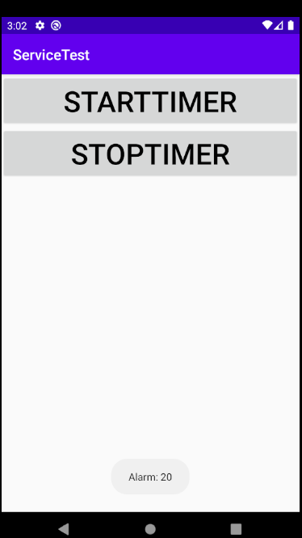

그러나 해당 Alarm을 끄기위해서 `App`에 재접속하여 STOPTIMER를 눌러도
TIMER가 멈추지 않고 점입가경으로 STARTTIMER를 누르게되면 또 하나의 `Thread`가 생겨 구동된다.<br/>
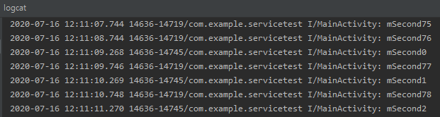<br/>
해당 `App`은 `Back버튼`을 눌러 `background`를 나가면 구동하고 있는 것처럼보이지만
App은 파괴되어 기존의 상태정보를 불러오지 못하는 상태이다.<br/>
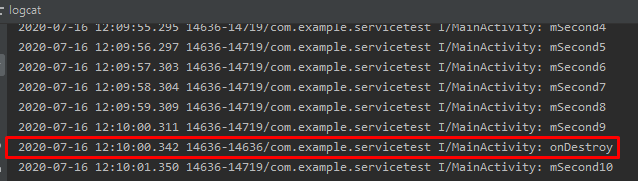<br/>
그러므로 우리는 App의 상태정보를 저장해두었다가 꺼내오는 `Bundle객체`를 사용한다.
그러나 실제상용코드에서 `Bundle`을 쓰게되면 하나의 `Thread`에 대해 
`Bundle SaveState`를 해주어야하기 떄문에 코드가 상당히 복잡해진다.

그러므로 `App파괴`와 상관없이 `Background`에서 계속하여 
실행 할 수 있게해야 하는데 이러한 기능을 제공하는 Android class가 `Servie`이다.

---
## Service Create
`Service 생성 -`
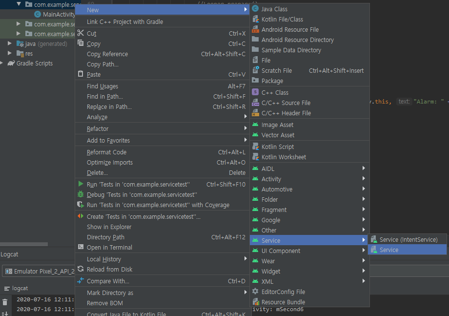

Android 내부에서 `Service`의 생성자를 이미 호출하기 때문에 
`Service`의 생성자에서 작업을 수행하는것은 권장되지 않는다.

```java
public class TimerService extends Service {
    public TimerSerivce(){
        //생성자는 삭제
    }
    @Override
    public IBinder onBind(Intent intent) {
        // TODO: Return the communication channel to the service.
        throw new UnsupportedOperationException("Not yet implemented");
    }
}
```
`Service`에서 `onBind()`도 실행하기때문에 자동으로 생성된다.

---
## Service Life Cycle

`Service 도입 -`<br/>
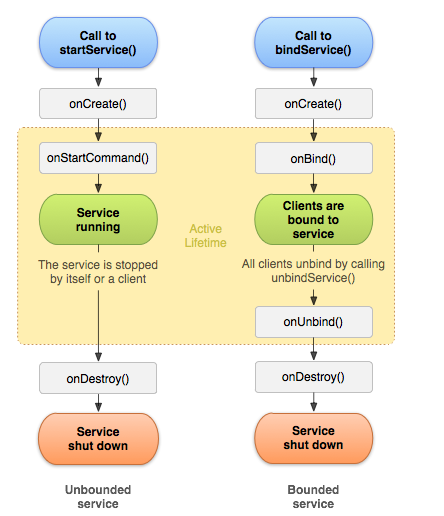

`Service` 최초 실행시 `onCreate()`메서드 호출 
`Service`가 최초실행 후에 다시 해당 `Service`를 호출하게되면 `onCreate()`가 아닌
`onStart()`메서드가 실행된다.

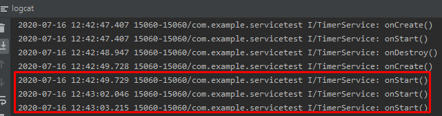

---
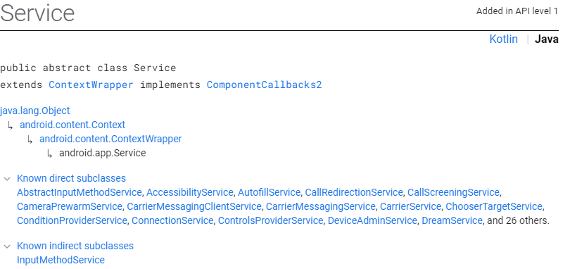

`context`를 상속받고 있는 `Service`
`Service` 또한 app을 구성하고 있는 요소이기 때문에 `context`를 가지고있다.

---
### Start Service
`onCreate()`, `onStartCommand()`, `onDestroy` 는 반드시 Override되어야한다.

`Service` 위에서 Thread.sleep을 이용한 코드
```java
public int onStartCommand(Intent intent, int flags, int startId) {
        super.onStartCommand(intent, flags, startId);
        Log.i(TAG, "onStartCommand()");
        if(!isRunning) {
            isRunning = true;

            mSecond = 0;
            isStop = false;
            while (mSecond <= ONE_HOUR) {
                if (isStop) break; //루프 진행여부 flag
                Log.i(TAG, "mSecond" + mSecond);

                ++mSecond;
                if ((mSecond % 10) == 0)
                    Toast.makeText(this, "Alarm: " + mSecond, Toast.LENGTH_SHORT).show();

                try { Thread.sleep(1000); } catch (InterruptedException e) {  }
            }
            isRunning = false;
        }
        return START_STICKY; //메모리 부족으로 종료되었다가 가용 메모리가 확보되면
                             //현재 서비스를 다시 기동하라는 플래그
    };
```
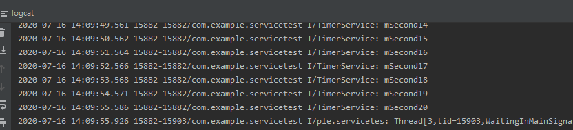
<br/>

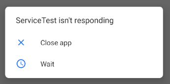
멈춰버렸다.


`Service`에서 `Thread`의 진행이 20초 이상 지연된다면 `ANR`이 뜨면서 `App`의 수행여부를 물어본다.

`UI Thread`를 멈춰두었기때문에 `UI update`가 이루어 지지않는다.
`Service`가 `UI Thread`에서 진행되는 `Component`이기 떄문이다.

그러므로 `Service`를 이용한 `Thread` 이용 함수 출력은 `WorkerThread`를 통해서 해야한다.

```java
 public int onStartCommand(Intent intent, int flags, int startId) {
        super.onStartCommand(intent, flags, startId);
        Log.i(TAG, "onStartCommand()");


        if(mTimerThread == null) {
            mSecond = 0;
            isStop = false;
            //Thread가 동작되는 동안 새로운 Thread를 만들지 못하기 위한 코드
            mTimerThread = new Thread(new Runnable() {
                @Override
                public void run() {
                    while (mSecond <= ONE_HOUR) {
                        if (isStop) break; //루프 진행여부 flag
                        Log.i(TAG, "mSecond" + mSecond);

                        ++mSecond;
                        if ((mSecond % 10) == 0)
                            Toast.makeText(TimerService.this, "Alarm: " + mSecond, Toast.LENGTH_SHORT).show();

                        try { Thread.sleep(1000); } catch (InterruptedException e) {  }
                    } //end of while
                    mTimerThread = null;
                }
            });
            mTimerThread.start();
        }
        return START_STICKY; //메모리 부족으로 종료되었다가 가용 메모리가 확보되면
        //현재 서비스를 다시 기동하라는 플래그
    };
```

그러나 해당 코드는 죽는다.

`오류가 되는부분 - `
`Toast.makeText(TimerService.this, "Alarm: " + mSecond, Toast.LENGTH_SHORT).show();`

`Toast`는 기본적으로 `View`이다 . 해당 `View`를 출력하는 `Thread`가 
`WorkerThread`이기 때문에 정책위반으로 runtime예외가 발생한다.

```java
public int onStartCommand(Intent intent, int flags, int startId) {
        super.onStartCommand(intent, flags, startId);
        Log.i(TAG, "onStartCommand()");


        if(mTimerThread == null) {
            mSecond = 0;
            isStop = false;
            //Thread가 동작되는 동안 새로운 Thread를 만들지 못하기 위한 코드
            mTimerThread = new Thread(new Runnable() {
                @Override
                public void run() {
                    while (mSecond <= ONE_HOUR) {
                        if (isStop) break; //루프 진행여부 flag
                        Log.i(TAG, "mSecond" + mSecond);

                        ++mSecond;
                        if ((mSecond % 10) == 0) {
                            mHandler.post(new Runnable() {
                                @Override
                                public void run() {
                                    Toast.makeText(TimerService.this, "Alarm: " + mSecond, Toast.LENGTH_SHORT).show();
                                }
                            });
                        }
                        try { Thread.sleep(1000); } catch (InterruptedException e) {  }
                    } //end of while
                    mTimerThread = null;
                }
            });
            mTimerThread.start();
        }
        return START_STICKY; //메모리 부족으로 종료되었다가 가용 메모리가 확보되면
        //현재 서비스를 다시 기동하라는 플래그
    };
```
그러므로 `WorkerThread`에서 실행을 하되 `Handler`를 만들어 해당 코드에대한 수행을
`MainActivity`에 이행함으로써 `UI Thread`에서 수행되게 만든다.

위와 같은 방식으로 `Activity` 가 파괴되어도 `Service` 상에서 구동되어 있기 때문에 `Background` 에서 해당의 기능이 유지된다.

위와 같은 `Service` 를 `Start Service` 라고 한다.

Android 에서는 `Start Service` 를 조금 더 쉽게 구현할 수 있게 해주는
`IntentService` 를 제공한다.

`IntentService Create - `
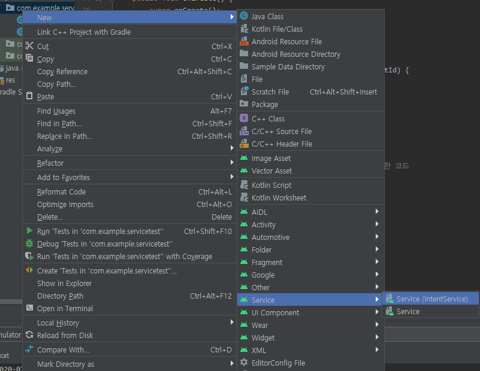

---
### Bind Service
`IPC` 환경에서 `Component`와 `Component`를 연결하기 위한 매커니즘이였다.
`OpenBinder` -> `Android Binder`

`RPC(Remote Procedure Call)` 원격에 있는 서로다른 프로세스 사이의 함수들을 사용 할 수 있게 해준다.
하드웨어를 제어하는 `Application`이 죽었을 때 대신할 수 있는 서비스를 생성하고 내부에 하드웨어 제어 메서드를 만든다.<br/>
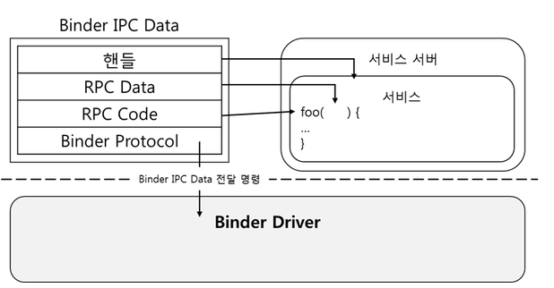<br/>

후에 다른 프로세스에서 해당 서비스의 하드웨어 제어 메서드만을 이용하여 
다른 프로세스가 해당 하드웨어를 제어 할 수 있게된다.<br/>
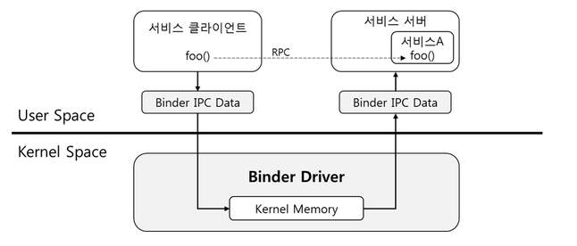<br/>


다른 프로세스 객체의 메서드를 `RPC Code`를 통한 Procedure Call의 정책을 
이용하여 원격으로 하드웨어를 제어할 수 있게된다.<br/>
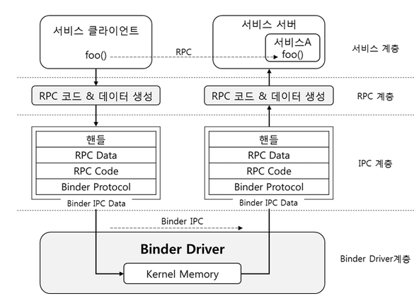

해당의 기능을 사용하기위해서 Client와 Server가 동일한 interface를 사용해야한다.

Android에서 `AIDL(Android Interface Definition Language)`을 통해 interfacef를 만들게 되면 Client객체와 Server객체를 만들게 된다.

`Bind Service Interface implements -`
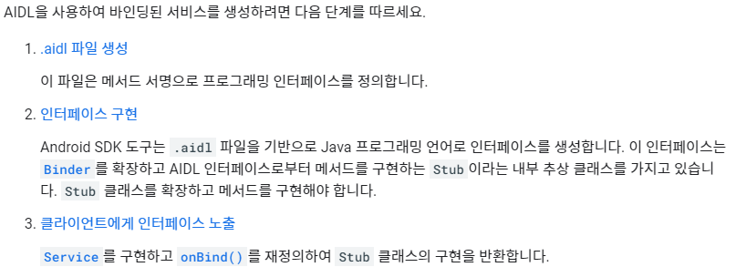

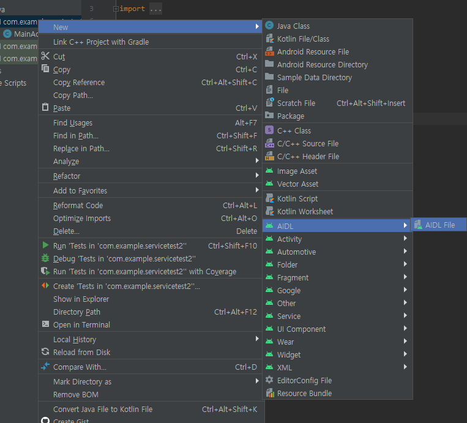


Proxy : 원격에 존재하는 서비스 객체의 함수 또는 메서드를 대신하여 호출하는 객체(대리자)
Stub : `Proxy`에 의해 요청된 메서드 또는 함수 호출을 실제 구현된 객체에게 전송하는 역할

서비스 객체를 구현하는 사람은 Stub class를 상속하여야한다.

`Bind Service - Server` 는 
`onCreate()`, `onBind` `onUnbind`, `onDestroy`가 Override 되어야한다.
```java
 public void onCreate() {
        super.onCreate();
        Log.i(TAG, "onCreate()");
    }

    @Override
    public void onDestroy() {
        Log.i(TAG, "onDestroy()");
        super.onDestroy();
    }

    @Override
    public boolean onUnbind(Intent intent) {
        Log.i(TAG, "onUnbind()");
        return super.onUnbind(intent);
    }

    @Override
    public IBinder onBind(Intent intent) {
        Log.i(TAG, "onBind()");
        // TODO: Return the communication channel to the service.
        throw new UnsupportedOperationException("Not yet implemented");
    }
```
Client와 묶을 interface의 Stub class 구현.
`Server - `
```java
private ICalcService.Stub mBinder = new ICalcService.Stub() {
        @Override
        public long doSquare(int number) throws RemoteException {
            return number * number;
        }

        @Override
        public int doDouble(int number) throws RemoteException {
            return number + number;
        }
    };
```
`interface - ICalcService`
```java
public interface ICalcService extends android.os.IInterface
{
  /** Default implementation for ICalcService. */
  public static class Default implements com.example.servicetest2.ICalcService
  {
      ...

public long doSquare(int number) throws android.os.RemoteException;
public int doDouble(int number) throws android.os.RemoteException;
```
`MainActivity - Client`
```java
private ICalcService mCalcService;
    private ServiceConnection mServiceConnection = new ServiceConnection() {
        //서비스가 시작되고 onBind가 호출되면 아래의 메서드가 호출되면서
        //서비스 객체에 대한 프록시가 IBinder에 반환됨
        @Override
        public void onServiceConnected(ComponentName componentName, IBinder iBinder) {
            mCalcService = ICalcService.Stub.asInterface(iBinder);
            //사용자의 Interface에 맞게 iBinder를 바꿔주는 함수.
        }

        @Override
        public void onServiceDisconnected(ComponentName componentName) {
            mCalcService = null;
            //Unbind는 Service가 끊어진것이므로 null로 처리하여 없앰.
        }
    };

    ...

    switch(view.getId()) {
        case R.id.doDoubleButton: {
            int result = mCalcService.doDouble(number);
            mResultTextView.setText(result + "");
            break;
        }
        case R.id.doSquareButton: {
            long result = mCalcService.doSquare(number);
            mResultTextView.setText(result + "");
            break;
        }
    }
```

서비스 객체를 구현하는 개발자는 반드시 IBinder interface를 구현해야한다.
BinderDriver는 IBinder 타입만 등록가능

---
#### Stub

`IBinder - `
```java
public interface IBinder {
                    //RPC code
    boolean transact(int var1, @NonNull Parcel var2, @Nullable Parcel var3, int var4) throws RemoteException;
}
```
`Binder - `
```java
public class Binder implements IBinder {
                                //RPC code
    protected boolean onTransact(int code, @NonNull Parcel data, @Nullable Parcel reply, int flags) throws RemoteException {
        throw new RuntimeException("Stub!");
    }
}
```
`Stub - `
```java
public static abstract class Stub extends android.os.Binder implements com.example.servicetest2.ICalcService{
    ...
                                      //RPC code
    @Override public boolean onTransact(int code, android.os.Parcel data, android.os.Parcel reply, int flags) throws android.os.RemoteException {

        ...

         case TRANSACTION_doSquare:
        {
          data.enforceInterface(descriptor);
          int _arg0;
          _arg0 = data.readInt();
          long _result = this.doSquare(_arg0);
          //this가 올 수 있는 이유 Stub이 ICalcService를 구현하는 구현클래스 이므로.
          reply.writeNoException();
          reply.writeLong(_result);
          return true;
        }
        case TRANSACTION_doDouble:
        {
          data.enforceInterface(descriptor);
          int _arg0;
          _arg0 = data.readInt();
          int _result = this.doDouble(_arg0);
          reply.writeNoException();
          reply.writeInt(_result);
          return true;
        }
    }
}
```
`CalcService`
```java
public class CalcService extends Service {
    private ICalcService.Stub mBinder = new ICalcService.Stub() {
        @Override
        public long doSquare(int number) throws RemoteException {
            return number * number;
        }

        @Override
        public int doDouble(int number) throws RemoteException {
            return number + number;
        }
    };
```

#### Proxy
```java
public void onServiceConnected(ComponentName componentName, IBinder iBinder) {
            mCalcService = ICalcService.Stub.asInterface(iBinder);
            //iBinder를 포함하고 있는 Proxy 호출
}
```
```java
private android.os.IBinder mRemote;
@Override public long doSquare(int number) throws android.os.RemoteException
@Override public int doDouble(int number) throws android.os.RemoteException
```
Proxy가 Kernel로 RPC code 전송/저장<br/>
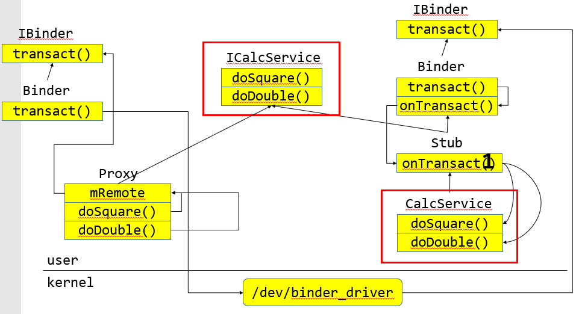

빨간□로 묶은 부분이 사용자 입력 부분이다.

---
### Service 정리
Start Service : 사용자에게 하여금 Service를 사용하고 
Bind Service : 

---
# Preference
서로다른 Activity가 사용가능.

`MainActivity - `
```java
protected void onPause() {
        super.onPause();
        //전역타입으로 정적메서드 제공
        SharedPreferences pref = getSharedPreferences("mypref", 0);

        SharedPreferences.Editor editor = pref.edit();

        String name = mNameEditText.getText().toString();
        String studentId = mStudentIdEditText.getText().toString();

        editor.putString("name", name);
        editor.putString("studentId", studentId);

        editor.commit();//동기화 Thread Safetying
    }
```
```java
protected void onCreate(Bundle savedInstanceState) {
        super.onCreate(savedInstanceState);
        setContentView(R.layout.activity_main);

        mNameEditText = findViewById(R.id.nameEditText);
        mStudentIdEditText = findViewById(R.id.studentIdExitText);

        //해당하는 Preference 읽어오기.
        SharedPreferences pref = getSharedPreferences("mypref",MODE_PRIVATE);
        if(pref !=null) {
            if (pref.contains("name"))
                mNameEditText.setText(pref.getString("name", ""));
            if (pref.contains("studentId"))
                mStudentIdEditText.setText(pref.getString("studentId", ""));
        }
    }
```
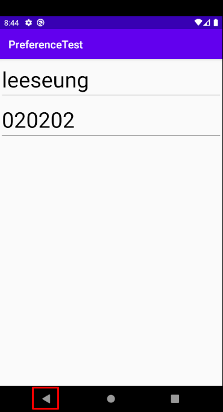

Back button으로 나갔다와도 사용자가 작성한 내용이 그대로 남아있다.
Bundle과 비교하여 한계가 있다.

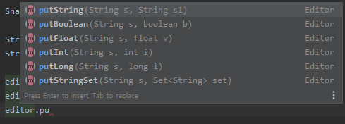<br/>
저장할 수 있는 타입이 몇 안됨.