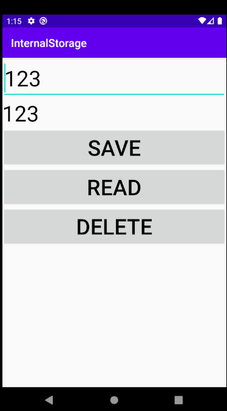

# Internal Storage
Activity의 정보를 갖는 context에 제공되는 메서드를 이용 Internal Storage를 활용 가능.
```java
public class MainActivity extends AppCompatActivity {
    private final static String TAG="MainActivity";

    EditText mInputEditText;
    TextView mDisplayTextView;

    @Override
    protected void onCreate(Bundle savedInstanceState) {
        super.onCreate(savedInstanceState);
        setContentView(R.layout.activity_main);

        mInputEditText = findViewById(R.id.inputEditText);
        mDisplayTextView = findViewById(R.id.printTextView);
    }


    public void onButtonClick(View view) {
        switch (view.getId()) {
            case R.id.saveButton: {
                String input = mInputEditText.getText().toString();
                if (input.isEmpty()) {
                    return;
                }
                //MODE_PRIVATE : 파일이 존재할 경우 , 덮어 쓴다.
                //MODE_APPEND : 파일의 뒤에 내용을 붙여쓴다.
                try {
                    FileOutputStream fos = openFileOutput("text.txt", Context.MODE_APPEND);
                    fos.write(input.getBytes());
                    fos.close();


                    Toast.makeText(this, "저장되었습니다." , Toast.LENGTH_LONG).show();
                } catch (IOException e) {
                    e.printStackTrace();
                }

                break;
            }
            case R.id.readButton: {
                try {
                    FileInputStream fis = openFileInput("text.txt");
                    byte[] data = new byte[fis.available()]; //fis의 허용가능한 만큼 읽어오고

                    while(fis.read(data) != -1) { //EOF를 만날때 까지 읽는다.
                        break;
                    }

                    fis.close();
                    mDisplayTextView.setText(new String(data)); //읽어온 byte data를 String으로 변환
                } catch (IOException e) {
                    e.printStackTrace();
                }
                break;
            }
            case R.id.deleteButton: {
                if(deleteFile("text.txt")) {
                    Toast.makeText(this, "삭제되었습니다", Toast.LENGTH_LONG).show();
                }
                else {
                    Toast.makeText(this, "삭제에 실패하였습니다.", Toast.LENGTH_SHORT).show();
                }
                break;
            }

        }
    }
}
```


---
# Database
