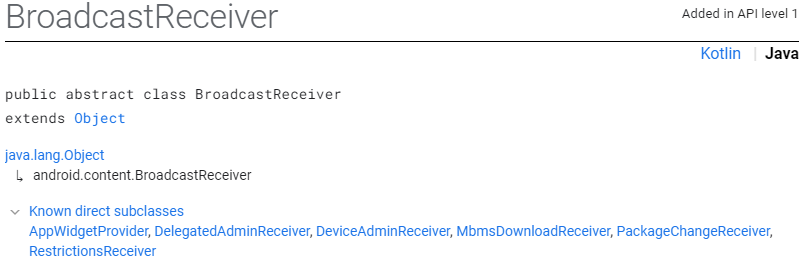
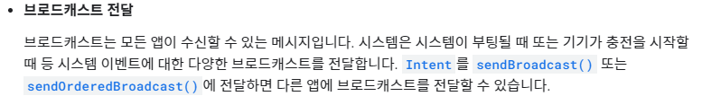

# Internal Storage
Activity의 정보를 갖는 context에 제공되는 메서드를 이용 Internal Storage를 활용 가능.
```java
public class MainActivity extends AppCompatActivity {
    private final static String TAG="MainActivity";

    EditText mInputEditText;
    TextView mDisplayTextView;

    @Override
    protected void onCreate(Bundle savedInstanceState) {
        super.onCreate(savedInstanceState);
        setContentView(R.layout.activity_main);

        mInputEditText = findViewById(R.id.inputEditText);
        mDisplayTextView = findViewById(R.id.printTextView);
    }


    public void onButtonClick(View view) {
        switch (view.getId()) {
            case R.id.saveButton: {
                String input = mInputEditText.getText().toString();
                if (input.isEmpty()) {
                    return;
                }
                //MODE_PRIVATE : 파일이 존재할 경우 , 덮어 쓴다.
                //MODE_APPEND : 파일의 뒤에 내용을 붙여쓴다.
                try {
                    FileOutputStream fos = openFileOutput("text.txt", Context.MODE_APPEND);
                    fos.write(input.getBytes());
                    fos.close();


                    Toast.makeText(this, "저장되었습니다." , Toast.LENGTH_LONG).show();
                } catch (IOException e) {
                    e.printStackTrace();
                }

                break;
            }
            case R.id.readButton: {
                try {
                    FileInputStream fis = openFileInput("text.txt");
                    byte[] data = new byte[fis.available()]; //fis의 허용가능한 만큼 읽어오고

                    while(fis.read(data) != -1) { //EOF를 만날때 까지 읽는다.
                        break;
                    }

                    fis.close();
                    mDisplayTextView.setText(new String(data)); //읽어온 byte data를 String으로 변환
                } catch (IOException e) {
                    e.printStackTrace();
                }
                break;
            }
            case R.id.deleteButton: {
                if(deleteFile("text.txt")) {
                    Toast.makeText(this, "삭제되었습니다", Toast.LENGTH_LONG).show();
                }
                else {
                    Toast.makeText(this, "삭제에 실패하였습니다.", Toast.LENGTH_SHORT).show();
                }
                break;
            }

        }
    }
}
```


---
# Database
## SQLite
```java
  SQLiteDatabase mDatabase;
  protected void onCreate(Bundle savedInstanceState) {
        super.onCreate(savedInstanceState);
        setContentView(R.layout.activity_main);

        mInputEditText = findViewById(R.id.inputEditText);
        mDisplayTextView = findViewById(R.id.displayTextView);
        mInputEditText.setOnKeyListener(new View.OnKeyListener() {
            @Override
            public boolean onKey(View view, int keyCode, KeyEvent keyEvent) {
                if(keyCode == KeyEvent.KEYCODE_ENTER) {
                    String content = mInputEditText.getText().toString();
                    if(!content.isEmpty()) {
                        //insert memo
                        insertMemo(content);

                        //입력 후 edittext 비우기
                        mInputEditText.setText(null);

                        //event처리 완료
                        return true;
                    }
                }
                return false;
            }
        });
        //database의 초기화는 onCreate에서
        mDatabase = initializeDatabase();

        //databasetable 생성
        initializeTable();
    }

      //데이터베이스 생성 또는 열기 메서드
      
    private SQLiteDatabase initializeDatabase() {
        SQLiteDatabase db = null;
        //getFilesDir() = Internal Storage의 경로를 읽어오는 매서드
        File dbFile = new File(getFilesDir(), DB_NAME);
        //DB의 이름이 파일.
        Log.i(TAG, "DB FILE PATH : " + dbFile.getAbsolutePath());

        try {
            db = SQLiteDatabase.openOrCreateDatabase(dbFile, null);
        }
        catch(SQLException e) {
            e.printStackTrace();
        }

        if(db == null) {
            Toast.makeText(this, "DB initialize Fail", Toast.LENGTH_SHORT).show();
        }

        return db;
    }
    private void initializeTable() {
        if (mDatabase == null) {
            return;
        }

        String query = String.format(
                //SQLite가 android와 bind가 되려면 android와 연결 될때 _id를 쓴다.
                //애초에 SQLite와 연동하려면 SQLite가 지정해놓은 _id를 쓰는게 매끄럽다.
          "CREATE TABLE IF NOT EXISTS %s (_id INTEGER PRIMARY KEY AUTOINCREMENT " +
                  //세미콜론 생략가능.
          ", datetime INTEGER, content TEXT)", TABLE_NAME;
          Log.i(TAG, query);

          //database에서 query실행
          mDatabase.execSQL(query);
    }

    private void insertMemo(String content) {
        if(content == null || content.isEmpty()) {
            return;
        }

        String query = String.format(
          "INSERT INTO %s (datetime, content) VALUES(%d, '%s')",
          TABLE_NAME, new Date().getTime(), content
        );
        Log.i(TAG, query);

        mDatabase.execSQL(query);
    }
```

```java
package com.example.dbtest;

import androidx.appcompat.app.AppCompatActivity;

import android.database.Cursor;
import android.database.SQLException;
import android.database.sqlite.SQLiteDatabase;
import android.os.Bundle;
import android.util.Log;
import android.view.KeyEvent;
import android.view.View;
import android.widget.EditText;
import android.widget.TextView;
import android.widget.Toast;

import java.io.File;
import java.text.SimpleDateFormat;
import java.util.Date;

public class MainActivity extends AppCompatActivity {
    final static String TAG="MainActivity";
    final static String DB_NAME="Memo.db";
    final static String TABLE_NAME = "memo";

    EditText mInputEditText;
    TextView mDisplayTextView;

    SQLiteDatabase mDatabase;

    @Override
    protected void onCreate(Bundle savedInstanceState) {
        super.onCreate(savedInstanceState);
        setContentView(R.layout.activity_main);

        mInputEditText = findViewById(R.id.inputEditText);
        mDisplayTextView = findViewById(R.id.displayTextView);
        mInputEditText.setOnKeyListener(new View.OnKeyListener() {
            @Override
            public boolean onKey(View view, int keyCode, KeyEvent keyEvent) {
                if(keyCode == KeyEvent.KEYCODE_ENTER) {
                    String content = mInputEditText.getText().toString();
                    if(!content.isEmpty()) {
                        //insert memo
                        insertMemo(content);

                        //입력 후 edittext 비우기
                        mInputEditText.setText(null);
                        displayDatabase();

                        //event처리 완료
                        return true;
                    }
                }
                return false;
            }
        });
        //database의 초기화는 onCreate에서
        mDatabase = initializeDatabase();

        //databasetable 생성
        initializeTable();
    }

    String data ="";
    //데이터베이스 display
    private void displayDatabase() {
        if(mDatabase ==null) {
            return;
        }
        String query = String.format("SELECT _id, datetime, content FROM %s", TABLE_NAME);
        Log.i(TAG, query);

        Cursor cursor = mDatabase.rawQuery(query, null);
        int count = cursor.getCount();
        data +="레코드 개수 : " + count + "\n";
        for (int i = 0; i < count; i++) {
            cursor.moveToNext();

            // 0        1           2
            //_id   datetime     content

            int id = cursor.getInt(0);
            String datetime = new SimpleDateFormat("yyyy-MM-dd HH:mm:ss").format(cursor.getInt(1));
            String content = cursor.getString(2);


            data += String.format("%d. %s %s \n", id, datetime, content);
            mDisplayTextView.setText(data);
        }
        cursor.close(); // cursor는 사용 후 자원반환을 해야한다.
    }

    //데이터베이스 생성 또는 열기 메서드
    private SQLiteDatabase initializeDatabase() {
        SQLiteDatabase db = null;
        //getFilesDir() = Internal Storage의 경로를 읽어오는 매서드
        File dbFile = new File(getFilesDir(), DB_NAME);
        //DB의 이름이 파일.
        Log.i(TAG, "DB FILE PATH : " + dbFile.getAbsolutePath());

        try {
            db = SQLiteDatabase.openOrCreateDatabase(dbFile, null);
        }
        catch(SQLException e) {
            e.printStackTrace();
        }

        if(db == null) {
            Toast.makeText(this, "DB initialize Fail", Toast.LENGTH_SHORT).show();
        }

        return db;
    }
    private void initializeTable() {
        if (mDatabase == null) {
            return;
        }

        String query = String.format(
                //SQLite가 android와 bind가 되려면 android와 연결 될때 _id를 쓴다.
                //애초에 SQLite와 연동하려면 SQLite가 지정해놓은 _id를 쓰는게 매끄럽다.
          "CREATE TABLE IF NOT EXISTS %s (_id INTEGER PRIMARY KEY AUTOINCREMENT " +
                  //세미콜론 생략가능.
          ", datetime INTEGER, content TEXT)", TABLE_NAME);
          Log.i(TAG, query);

          //database에서 query실행
          mDatabase.execSQL(query);
    }

    private void insertMemo(String content) {
        if(content == null || content.isEmpty()) {
            return;
        }

        String query = String.format(
          "INSERT INTO %s (datetime, content) VALUES(%d, '%s')",
          TABLE_NAME, new Date().getTime(), content
        );
        Log.i(TAG, query);

        mDatabase.execSQL(query);
    }
}
```

```java
public final class MemoContract {
    //객체를 생성하여 다른 사람이 코드를 변조하는것을 막기 위해
    //인스턴스 생성을 금지
    private MemoContract(){

    }

    // memo 테이블에 대한 컬럼 정의
    public static class MemoEntry implements BaseColumns {
        public static final String TABLE_NAME = "memo";
        public static final String COLUMN_NAME_CONTENT = "content";
        public static final String COLUMN_NAME_DATETIME = "datetime";
    }
}

```
```java
public class MemoDbHelper extends SQLiteOpenHelper {
    //데이터베이스의 스키마가 변경될 경우 아래의 버전은
    // 반드시 올라가거나 내려가야 한다.
    private final static String DB_NAME = "Memo.db";
    private final static int DB_VERSION = 1;


    // 헬퍼클래스를 싱글턴 패턴으로 구현한다.
    // 그러나 서로다른 Thread가 접근한다고 하면 Contect switching이 발생하므로
    // 동기화를 해주어야한다.
    //---------------------------------------------------------------------
    //객체를 임의로 생성할 수 없도록 생성자를 private으로 지정
    private MemoDbHelper(Context context) {
        //생성자는 반드시 아래의 부모생성자를 호출해야한다.
        super(context, DB_NAME, null, DB_VERSION);
    }
    //유일한 객체를 반환하는 정적 인터페이스 제공
    private static MemoDbHelper sInstance = null;
    public static synchronized MemoDbHelper getInstance(Context context) {
        if(sInstance == null) {
            //context가 두가지
            //activity나 compoenet의 context와
            //application 단위의 context가 있다.

            //db같은 경우는 여러곳에서 쓰니까 application단위의 context를 쓰자.
            sInstance = new MemoDbHelper(context.getApplicationContext());
        }
        return sInstance;
    }
    //---------------------------------------------------------------------

    //테이블 생성 쿼리문
    private static final String SQL_CREATE_TABLE = String.format(
            "CREATE TABLE %s (%s INTEGER PRIMARY KEY AUTOINCREMENT, %s INTEGER, %s TEXT)",
            MemoContract.MemoEntry.TABLE_NAME,
            MemoContract.MemoEntry._ID,
            MemoContract.MemoEntry.COLUMN_NAME_DATETIME,
            MemoContract.MemoEntry.COLUMN_NAME_CONTENT
    );


    //아래위 두 메서드는 반드시 오버라이드 해야한다.
    @Override
    public void onCreate(SQLiteDatabase sqLiteDatabase) {
        //데이터베이스가 처음으로 사용 될 때 처음으로 호출

        //상속하고있는 SQLiteOpenHelper에서 꺼내옴.
        sqLiteDatabase.execSQL(SQL_CREATE_TABLE);
    }

    @Override
    public void onUpgrade(SQLiteDatabase sqLiteDatabase, int i, int i1) {
        //데이터베이스의 버전이 올라갈때 호출되는 메서드
        // ...
    }
}
```

```java
 public void insertMemo(String content) {
        if(content == null || content.isEmpty()) {
            return;
        }

        //mDatabase.execQuery(...);
        //테이블에 삽입할 데이터를 준비
        ContentValues contentValues = new ContentValues();
        contentValues.put(MemoContract.MemoEntry.COLUMN_NAME_CONTENT, content);
        contentValues.put(MemoContract.MemoEntry.COLUMN_NAME_DATETIME, new Date().getTime());

        //Database에 무언가를 쓰기위한 전용객체.
        SQLiteDatabase sqLiteDatabase = MemoDbHelper.getInstance(this).getWritableDatabase();

        //data 밀어넣기
        long result = sqLiteDatabase.insert(MemoContract.MemoEntry.TABLE_NAME, null, contentValues);

        if(result == -1 )  {//오류발생
            Toast.makeText(this, "메모 저장 오류", Toast.LENGTH_SHORT).show();
        }
        else
            Toast.makeText(this, "저장되었습니다.", Toast.LENGTH_SHORT).show();
    }
```
```java
public class MainActivity extends AppCompatActivity {
    private final static String TAG= "MainActivity";

    private EditText mInputEdit;
    private ListView mListView;
    private MemoAdapter mMemoAdapter;

    @Override
    protected void onCreate(Bundle savedInstanceState) {
        super.onCreate(savedInstanceState);
        setContentView(R.layout.activity_main);

        mListView = findViewById(R.id.listView);
        mInputEdit = findViewById(R.id.inputEditText);
        //mMemoAdapter = new MemoAdapter(this, getMemoCursor());
        mInputEdit.setOnKeyListener(new View.OnKeyListener() {
            @Override
            public boolean onKey(View view, int keyCode, KeyEvent keyEvent) {
                if(keyCode == KeyEvent.KEYCODE_ENTER) {
                    String content = mInputEdit.getText().toString();
                    if(!content.isEmpty()) {
                        insertMemo(content);
                        mInputEdit.setText(null);
                        mListView.setAdapter(new MemoAdapter(MainActivity.this, getMemoCursor()));
                        //메모를 삽입
                        return true;
                    }
                }
                return false;
            }
        });

        //ListView에 대한 Adapter를 SQLite에서 읽어온 데이터 mMemo의 Adapter를 사용한 구문.

        //mListView.setAdapter(mMemoAdapter);
    }

    public void insertMemo(String content) {
        if(content == null || content.isEmpty()) {
            return;
        }

        //mDatabase.execQuery(...);
        //테이블에 삽입할 데이터를 준비
        ContentValues contentValues = new ContentValues();
        contentValues.put(MemoContract.MemoEntry.COLUMN_NAME_CONTENT, content);
        contentValues.put(MemoContract.MemoEntry.COLUMN_NAME_DATETIME, new Date().getTime());

        //Database에 무언가를 쓰기위한 전용객체.
        SQLiteDatabase sqLiteDatabase = MemoDbHelper.getInstance(this).getWritableDatabase();

        //data 밀어넣기
        long result = sqLiteDatabase.insert(MemoContract.MemoEntry.TABLE_NAME, null, contentValues);

        if(result == -1 )  {//오류발생
            Toast.makeText(this, "메모 저장 오류", Toast.LENGTH_SHORT).show();
        }
        else
            Toast.makeText(this, "저장되었습니다.", Toast.LENGTH_SHORT).show();
    }

    private Cursor getMemoCursor() {
        MemoDbHelper memoDbHelper = MemoDbHelper.getInstance(this);
        SQLiteDatabase sqLiteDatabase = memoDbHelper.getReadableDatabase();
        return sqLiteDatabase.query(MemoContract.MemoEntry.TABLE_NAME,
                null, null, null, null, null, null);
    }

    private static class MemoAdapter extends CursorAdapter{
        //부모 생성자를 호출해야 한다.
        public MemoAdapter(Context context, Cursor cursor){
            super(context, cursor, false);
        }

        @Override
        public View newView(Context context, Cursor cursor, ViewGroup viewGroup) {
            //rootView가 아니므로 false
            return LayoutInflater.from(context).inflate(R.layout.item, viewGroup, false);
        }

        @Override
        public void bindView(View view, Context context, Cursor cursor) {
            //content로 index를 찾아 String 반환
            String content = cursor.getString(cursor.getColumnIndexOrThrow(MemoContract.MemoEntry.COLUMN_NAME_CONTENT));
            //datetime으로 index를 찾아 long 반환
            long time = cursor.getLong(cursor.getColumnIndexOrThrow(MemoContract.MemoEntry.COLUMN_NAME_DATETIME));
            //time을 찍을 format 설정
            String dateTime = new SimpleDateFormat("yyyy-MM-dd HH:mm:ss").format(time);
            TextView contentText = view.findViewById(R.id.contentTextViewItem);
            contentText.setText(content);

            TextView datetimeText = view.findViewById(R.id.datetimeTextViewItem);
            datetimeText.setText(dateTime);

        }
    }
}
```
---
# BroadCast




```java
BroadcastReceiver mReceiver = new BroadcastReceiver() {

        @Override
        public void onReceive(Context context, Intent intent) {
            ++count;

            String action = intent.getAction();
            if(action.equals(Intent.ACTION_BATTERY_CHANGED)) {
                displayBatteryState(intent);
            }

            switch (action) {
                case Intent.ACTION_BATTERY_LOW:
                    Toast.makeText(MainActivity.this,"배터리가 부족합니다", Toast.LENGTH_LONG).show();
                    break;
                case Intent.ACTION_BATTERY_OKAY:
                    Toast.makeText(MainActivity.this,"배터리 양호", Toast.LENGTH_LONG).show();
                    break;
                case Intent.ACTION_POWER_CONNECTED:
                    Toast.makeText(MainActivity.this,"전원 연결됨", Toast.LENGTH_LONG).show();
                    break;
                case Intent.ACTION_POWER_DISCONNECTED:
                    Toast.makeText(MainActivity.this,"전원이 분리됨", Toast.LENGTH_LONG).show();
                    break;
            }
        }
    };
```
---
# 암시적 intent
```java
Intent intent = new Intent(Intent.ACTION_CALL);
        intent.setData(Uri.parse("tel:"+phoneNumber)); //URI 형식의 data를 받는다.
                                                        //parse할때 공백이 없도록 하자
        startActivity(intent);
```

---
## permission
위의 CALL과 같은 ACTION은 사용자의 허락을 요구한다.
```java
public void onButtonClick(View view) {
        String phoneNumber = mPhoneNumberEdit.getText().toString();
        if(phoneNumber.isEmpty()) {
            return;
        }
        //사용자로부터 권한을 얻은 다음 실행하여야 한다.
        if(ContextCompat.checkSelfPermission(this, Manifest.permission.CALL_PHONE)
                == PackageManager.PERMISSION_GRANTED) {//호환성체크

            //체크가 되었다면 승낙
            Intent intent = new Intent(Intent.ACTION_CALL);
            intent.setData(Uri.parse("tel:" + phoneNumber)); //URI 형식의 data를 받는다.
            //parse할때 공백이 없도록 하자
            startActivity(intent);
        }
        //사용자가 해당 권한을 승인하지 않은 경우, 권한 승인 요청을 해야한다.
        try{
            ActivityCompat.requestPermissions(this,
                    new String[] {Manifest.permission.CALL_PHONE}, REQUEST_CALL_PHONE);
        }
        catch (SecurityException e) {e.printStackTrace();}
    }


    //사용자의 승낙 여부 확인.
    @Override
    public void onRequestPermissionsResult(int requestCode, @NonNull String[] permissions, @NonNull int[] grantResults) {
        switch (requestCode) {
            case REQUEST_CALL_PHONE:
                for (int i = 0; i < permissions.length ; i++) {
                    String permission = permissions[i];
                    int grantResult = grantResults[i];
                    if(permission.equals(Manifest.permission.CALL_PHONE)) {
                        String phoneNumber = mPhoneNumberEdit.getText().toString();

                        Uri uri = Uri.parse("tel:"+phoneNumber);
                        startActivity(new Intent(Intent.ACTION_CALL, uri));
                    }
                    else {
                        return;
                    }
                }
                break;
        }
        super.onRequestPermissionsResult(requestCode, permissions, grantResults);
    }
```