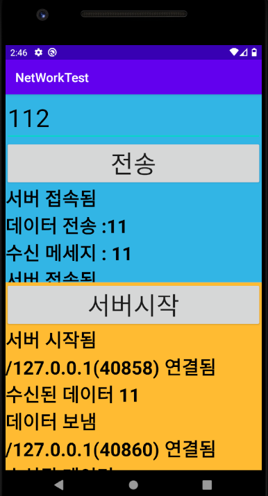
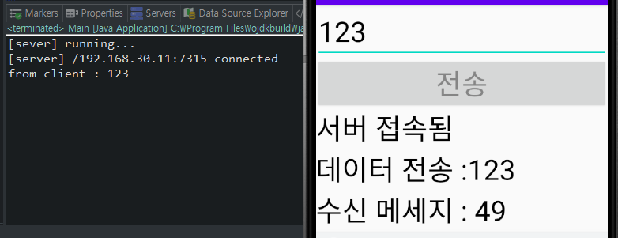

# Android Studio App Making

>참고 https://www.data.go.kr/

OPEN API 활용 신청 
> https://www.data.go.kr/ugs/selectPublicDataUseGuideView.do


---
# Android 에서 Server와 Client 구현

화면 구성
```xml
<?xml version="1.0" encoding="utf-8"?>
<LinearLayout xmlns:android="http://schemas.android.com/apk/res/android"
    xmlns:app="http://schemas.android.com/apk/res-auto"
    xmlns:tools="http://schemas.android.com/tools"
    android:layout_width="match_parent"
    android:layout_height="match_parent"
    android:orientation="vertical"
    tools:context=".MainActivity">

    <!--  클라이언트 뷰 -->
    <LinearLayout
        android:layout_width="match_parent"
        android:layout_height="0dp"
        android:layout_weight="50"
        android:background="@android:color/holo_blue_light"
        android:orientation="vertical" >

        <EditText
            android:id="@+id/inputEditText"
            android:layout_width="match_parent"
            android:layout_height="wrap_content"
            android:textSize="40sp"
            android:hint="메세지입력"
            android:textColor="#FF000000"
            />
        <Button
            android:id="@+id/sendButton"
            android:layout_width="match_parent"
            android:layout_height="wrap_content"
            android:textSize="40sp"
            android:text="전송"
            />

        <ScrollView
            android:layout_width="match_parent"
            android:layout_height="match_parent" >
            <TextView
                android:id="@+id/clientLogTextView"
                android:layout_width="match_parent"
                android:layout_height="wrap_content"
                android:textSize="30sp"
                android:textColor="#FF000000"
                android:textStyle="bold"
                />
        </ScrollView>
    </LinearLayout>

    <!--  서버 뷰 -->
    <LinearLayout
        android:layout_width="match_parent"
        android:layout_height="0dp"
        android:layout_weight="50"
        android:background="@android:color/holo_orange_light"
        android:orientation="vertical" >
        <Button
            android:id="@+id/startButton"
            android:layout_width="match_parent"
            android:layout_height="wrap_content"
            android:textSize="40sp"
            android:text="서버시작"
            />

        <ScrollView
            android:layout_width="match_parent"
            android:layout_height="match_parent" >
            <TextView
                android:id="@+id/serverLogTextView"
                android:layout_width="match_parent"
                android:layout_height="wrap_content"
                android:textSize="30sp"
                android:textColor="#FF000000"
                android:textStyle="bold"
                />
        </ScrollView>
    </LinearLayout>

</LinearLayout>
```

서버 및 클라이언트 구성
```java
package com.example.networktest;

import androidx.appcompat.app.AppCompatActivity;

import android.os.Bundle;
import android.view.View;
import android.widget.Button;
import android.widget.EditText;
import android.widget.TextView;

import org.w3c.dom.Text;

import java.io.IOException;
import java.io.ObjectInputStream;
import java.io.ObjectOutputStream;
import java.net.InetAddress;
import java.net.ServerSocket;
import java.net.Socket;

public class MainActivity extends AppCompatActivity {
    private final static String TAG="MainActivity";
    private final int PORT_NUMBER = 6666;

    private EditText mInputEdit;
    private TextView mSeverLogTextView;
    private TextView mClientLogTextView;

    @Override
    protected void onCreate(Bundle savedInstanceState) {
        super.onCreate(savedInstanceState);
        setContentView(R.layout.activity_main);

        mInputEdit = findViewById(R.id.inputEditText);
        mSeverLogTextView = findViewById(R.id.serverLogTextView);
        mClientLogTextView = findViewById(R.id.clientLogTextView);

        Button startButton = findViewById(R.id.startButton);
        startButton.setOnClickListener(new View.OnClickListener() {

            @Override
            public void onClick(View v) {
                //서버 구동코드
                startServer();
            }
        });

        Button sendButton = findViewById(R.id.sendButton);
        sendButton.setOnClickListener(new View.OnClickListener() {
            @Override
            public void onClick(View v) {
                //메세지 전송 코드
                String message = mInputEdit.getText().toString();
                if(message.isEmpty()) return;

                send(message);
            }
        });

    }

    private void send(String message) {
        Socket socket = null;
        ObjectOutputStream oos = null;
        ObjectInputStream ois= null;

        try {
            //Client connect
            socket = new Socket("localhost", PORT_NUMBER);
            printClientLog("서버 접속됨");

            oos = new ObjectOutputStream(socket.getOutputStream());
            oos.writeObject(message);
            oos.flush();
            printClientLog("데이터 전송 :" + message);


            ois = new ObjectInputStream(socket.getInputStream());
            printClientLog("수신 메세지 : " + ois.readObject());


        }
        catch (Exception e) {
            e.printStackTrace();
        }
        finally {
            if(oos != null ) {
                try { oos.close(); } catch (IOException e) { e.printStackTrace(); }
            }
            if(ois != null ) {
                try { ois.close(); } catch (IOException e) { e.printStackTrace(); }
            }
            if(socket != null) {
                try { socket.close(); } catch (IOException e) { e.printStackTrace(); }
            }
        }
    }

    private void printClientLog(String message) {
        mClientLogTextView.setText(message +"\n");
    }

    private void printServerLog(String message) {
        mSeverLogTextView.setText(message + "\n");
    }

    private void startServer() {
        ServerSocket server = null;
        ObjectInputStream ois = null;
        ObjectOutputStream oos = null;
        try {
            server = new ServerSocket(PORT_NUMBER);
            //Exception 발생
            printServerLog("서버 시작됨");

            while(true) {
                Socket socket = server.accept();


                int port = socket.getPort();
                InetAddress address = socket.getLocalAddress();

                printServerLog(String.format("%s(%d) 연결됨", address.toString(), port));


                //Log 읽어오기
                ois = new ObjectInputStream(socket.getInputStream());
                Object object = ois.readObject();

                printServerLog("수신된 데이터 " + object);

                //Log 쓰기
                oos = new ObjectOutputStream(socket.getOutputStream());
                oos.writeObject(object);
                oos.flush();

                printServerLog("데이터 보냄");
            }
        }
        catch(Exception e) {
            e.printStackTrace();
        }
        finally {
            if(oos != null ) {
                try { oos.close(); } catch (IOException e) { e.printStackTrace(); } }

            if(ois != null ) {
                try { ois.close(); } catch (IOException e) { e.printStackTrace(); }
            }
            if(server != null) {
                try { server.close(); } catch (IOException e) { e.printStackTrace(); }
            }
        }
    }
}

```
해당 코드는 Exception 발생
`java.net.SocketException: socket failed: EPERM (Operation not permitted)`

UI Thread에서 NetWork 작업 시 발생

NetWork에 관련한 코드는 WorkThread로 빼야한다.

```java
startButton.setOnClickListener(new View.OnClickListener() {
            @Override
            public void onClick(View v) {
                //서버 구동코드
                new Thread(new Runnable() {
                    @Override
                    public void run() {
                        startServer();
                    }
                }).start();
            }
        });

        Button sendButton = findViewById(R.id.sendButton);
        sendButton.setOnClickListener(new View.OnClickListener() {
            @Override
            public void onClick(View v) {
                final String message = mInputEdit.getText().toString();
                if(message.isEmpty()) return;
                //메세지 전송 코드
                new Thread(new Runnable() {
                    @Override
                    public void run() {
                        send(message);
                    }
                }).start();
            }
        });
```
```java
private void printClientLog(final String message) {
    runOnUiThread(new Runnable() {
        @Override
        public void run() {
            mClientLogTextView.setText(message +"\n");
        }
    });

}

private void printServerLog(final String message) {
    runOnUiThread(new Runnable() {
        @Override
        public void run() {
            mSeverLogTextView.setText(message + "\n");
        }
    });
}
```
```
java.net.SocketException: socket failed: EPERM (Operation not permitted)
```
외부 인터넷 연결 시 `AndroidManifest.xml`에서 인터넷 `permission` 해주기
` <uses-permission android:name="android.permission.INTERNET" />`
기존의 `Application` 삭제하고 다시 구동



---
# 외부 Java에서 EchoServer 생성
```java
public class Main {
	public static void main(String[] args) {
		ServerSocket serverSocket = null;
		Socket clientSocket =null;
		BufferedReader br = null;
		BufferedWriter bw = null;
		try {
			serverSocket = new ServerSocket(6666);
			System.out.println("[sever] running...");

			clientSocket = serverSocket.accept();
			InetAddress address = clientSocket.getInetAddress();
			int port = clientSocket.getPort();
			System.out.println(String.format("[server] %s:%d connected", address, port));
			
			
			OutputStream out = clientSocket.getOutputStream();
			InputStream in = clientSocket.getInputStream();
			
			br = new BufferedReader(new InputStreamReader(in));
			bw = new BufferedWriter(new OutputStreamWriter(out));
			
			
			String line = br.readLine();
			if(line != null) {
				System.out.println("from client : " + line);
				bw.write(line);
				bw.flush();
			}
			
		} 
		catch (Exception e) {e.printStackTrace();} 
		finally {
			if(br != null)  {try {br.close();} catch (Exception e) {e.printStackTrace();}}
			if(bw != null)  {try {bw.close();} catch (Exception e) {e.printStackTrace();}}
			if (serverSocket != null) {try {serverSocket.close();} catch (Exception e) {e.printStackTrace();}}
			if (clientSocket != null) {try {clientSocket.close();} catch (Exception e) {e.printStackTrace();}}
		}
	}
}
```
Android Studio Client Code

`Local Test`라고 하더라도 `AVD`는 가상의 공간이기 때문에
`localhost`가 아닌 실행체의 `IPv4`를 입력해야한다.

```java
package com.example.networktest2;

import androidx.appcompat.app.AppCompatActivity;

import android.os.Bundle;
import android.view.View;
import android.widget.Button;
import android.widget.EditText;
import android.widget.TextView;

import java.io.BufferedReader;
import java.io.BufferedWriter;
import java.io.IOException;
import java.io.InputStreamReader;
import java.io.ObjectInputStream;
import java.io.ObjectOutputStream;
import java.io.OutputStreamWriter;
import java.net.InetAddress;
import java.net.ServerSocket;
import java.net.Socket;

public class MainActivity extends AppCompatActivity {
    private final static String TAG="MainActivity";
    private final int PORT_NUMBER = 6666;

    private EditText mInputEdit;
    private TextView mClientLogTextView;


    @Override
    protected void onCreate(Bundle savedInstanceState) {
        super.onCreate(savedInstanceState);
        setContentView(R.layout.activity_main);

        mInputEdit = findViewById(R.id.inputEditTExt);
        mClientLogTextView = findViewById(R.id.clientLogTextView);

        Button sendButton = findViewById(R.id.sendButton);
        sendButton.setOnClickListener(new View.OnClickListener() {
            @Override
            public void onClick(View v) {
                final String message = mInputEdit.getText().toString();
                if(message.isEmpty()) return;
                //메세지 전송 코드
                new Thread(new Runnable() {
                    @Override
                    public void run() {
                        send(message);
                    }
                }).start();
            }
        });
    }

    private void send(String message) {
        Socket socket = null;
        ObjectOutputStream oos = null;
        ObjectInputStream ois= null;
        BufferedReader br = null;
        BufferedWriter bw = null;

        try {
            //Client connect
            socket = new Socket("192.168.30.11", PORT_NUMBER);
            printClientLog("서버 접속됨");

            br = new BufferedReader(new InputStreamReader(socket.getInputStream()));
            bw = new BufferedWriter(new OutputStreamWriter(socket.getOutputStream()));

            bw.write(message +"\n");
            bw.flush();
            printClientLog("데이터 전송 :" + message );

            printClientLog("수신 메세지 : " + br.read());


        }
        catch (Exception e) {
            e.printStackTrace();
        }
        finally {
            if(br != null ) {
                try { br.close(); } catch (IOException e) { e.printStackTrace(); }
            }
            if(bw != null ) {
                try { bw.close(); } catch (IOException e) { e.printStackTrace(); }
            }
            if(socket != null) {
                try { socket.close(); } catch (IOException e) { e.printStackTrace(); }
            }
        }
    }

    private void printClientLog(final String message) {
        runOnUiThread(new Runnable() {
            @Override
            public void run() {
                mClientLogTextView.append(message +"\n"); //readLine으로 읽으므로 개행을 꼭 넣어야한다.
            }
        });

    }
}
```


---
# Chatting App
```java
import java.io.BufferedReader;
import java.io.BufferedWriter;
import java.io.IOException;
import java.io.InputStreamReader;
import java.io.OutputStreamWriter;
import java.net.ServerSocket;
import java.net.Socket;
import java.util.ArrayList;
import java.util.Iterator;

public class Main {
	public static void main(String[] args) throws IOException{
		new Main(6666).run();
	}
	
	private class Client {
		Socket socket;
		String email;
		BufferedWriter writer;
		BufferedReader reader;
		
		public Client(Socket socket) throws IOException{
			this.socket = socket;
			writer = new BufferedWriter(new OutputStreamWriter(socket.getOutputStream()));
			reader = new BufferedReader(new InputStreamReader(socket.getInputStream()));
		}
	}
	
	private ArrayList<Client> clients = new ArrayList<>();
	
	private Object lock = new Object();
	
	private ServerSocket serverSocket = null;
	
	public Main(int port) throws IOException{
		serverSocket = new ServerSocket(port);
	}
	
	public void run() {
		System.out.println("[server] running...");
		while(true) {
			try {
				Socket clientSocket = serverSocket.accept();
				new ChatReceiver(clientSocket).start();
			}
			catch (Exception e) {e.printStackTrace();}
		}
	}
	private class ChatReceiver extends Thread {
		Socket socket;
		public ChatReceiver(Socket socket) {
			this.socket = socket;
		}
		
		@Override
		public void run() {
			Client client = null;
			try {
				client = new Client(socket);
				client.email = client.reader.readLine();
				//사용자로부터 이메일 주소 수신
				System.out.println(String.format("[server] %s:%d connected", socket.getInetAddress().getHostAddress(), socket.getPort()));
				
				synchronized(lock) {
					clients.add(client);
				}
				broadcast(client.email+ "entered");
				
				String message = null;
				while(true) {
					message = client.reader.readLine();
					if(message == null || message.equals("bye")) break;
					
					broadcast(String.format("[%s] %s", client.email , message ));
				}
			}
			catch (Exception e) {
				e.printStackTrace();
			}
			finally {
				synchronized(lock) {
					clients.remove(client);
				}
				broadcast(client.email+ " is left");
				
				if(client.reader != null) {
					try {client.reader.close();}catch(Exception e) {e.printStackTrace();}
				}
				if(client.writer!= null) {
					try {client.writer.close();}catch(Exception e) {e.printStackTrace();}
				}
				if(socket != null) {
					try {socket.close();}catch (Exception e) {e.printStackTrace();}
				}
			}
		}

		private synchronized void broadcast(String string) {
			Iterator<Client> itr = clients.iterator();
			while(itr.hasNext()) {
				Client client = itr.next();
				try {
					client.writer.write(string +"\n");
					client.writer.flush();
				}
				catch (Exception e) {
					e.printStackTrace();
				}
			}
		}
	}
}

```

```java
package com.example.chattingapp;

import androidx.appcompat.app.AppCompatActivity;

import android.os.Bundle;
import android.view.View;
import android.widget.Button;
import android.widget.EditText;
import android.widget.TextView;
import android.widget.Toast;

import java.io.BufferedInputStream;
import java.io.BufferedOutputStream;
import java.io.BufferedReader;
import java.io.BufferedWriter;
import java.io.IOException;
import java.io.InputStreamReader;
import java.io.OutputStreamWriter;
import java.net.Socket;

public class MainActivity extends AppCompatActivity {
    private final static String TAG="MainActivity";

    private final static String SERVER_ADDRESS = "192.168.30.11";
    private final static int PORT = 6666;

    private EditText emailEdit;
    private EditText msgEdit;
    private TextView chatView;

    private Socket mSocket;
    private BufferedReader reader;
    private BufferedWriter writer;

    @Override
    protected void onCreate(Bundle savedInstanceState) {
        super.onCreate(savedInstanceState);
        setContentView(R.layout.activity_main);

        emailEdit = findViewById(R.id.emailEditText);
        msgEdit = findViewById(R.id.messageEditText);
        chatView = findViewById(R.id.charTextView);

        Button connectButton = findViewById(R.id.connectButton);
        connectButton.setOnClickListener(new View.OnClickListener() {
            @Override
            public void onClick(View v) {
                connectServer();
            }
        });

        Button sendButton = findViewById(R.id.sendButton);
        sendButton.setOnClickListener(new View.OnClickListener() {
            @Override
            public void onClick(View v) {
                final String message = msgEdit.getText().toString();
                new Thread(new Runnable() {
                    @Override
                    public void run() {
                        send(message);
                    }
                }).start();
            }
        });
    }

    private void send(String data) {
        try {
            writer.write(data +"\n");
            writer.flush();
        } catch (IOException e) {
            e.printStackTrace();
        }
    }

    private void connectServer() {
        final String email = emailEdit.getText().toString();
        if(email.isEmpty()) {
            Toast.makeText(MainActivity.this, "이메일을 입력하세요", Toast.LENGTH_SHORT).show();
            return;
        }
        new Thread(new Runnable() {
            @Override
            public void run() {
                try { mSocket = new Socket(SERVER_ADDRESS, PORT);
                    runOnUiThread(new Runnable() {
                        @Override
                        public void run() {
                            Toast.makeText(MainActivity.this,"서버에 접속하였습니다", Toast.LENGTH_LONG).show();
                        }
                    });

                    writer = new BufferedWriter(new OutputStreamWriter(mSocket.getOutputStream()));
                    reader = new BufferedReader(new InputStreamReader(mSocket.getInputStream()));


                    writer.write(email + "\n");
                    writer.flush();

                    while(true) {
                        final String message = reader.readLine();
                        if(message == null) {
                            continue;
                        }
                        runOnUiThread(new Runnable() {
                            @Override
                            public void run() {
                                chatView.append(message + "\n");
                            }
                        });
                    }
                }
                catch (IOException e) { e.printStackTrace(); }
            }
        }).start();
    }
}

```

# Value Object를 사용한 서버와 클라이언트간의 통신

Value Object에 대한 정보는 client와 server 둘다 있어야한다.
```java
public class ValueObject implements Serializable {


    public final static int ADD = 0;
    public final static int SUB = 1;
    public final static int MUL = 2;
    public final static int DIV = 3;

    private int op1;
    private int op2;
    private int opcode;


    public ValueObject(int op1, int op2, int opcode) {
        this.op1 = op1;
        this.op2 = op2;
        this.opcode = opcode;
    }
    public ValueObject() { }

    public int getOp1() { return op1; }
    public int getOp2() { return op2; }
    public int getOpcode() { return opcode; }

    public void setOp1(int op1) { this.op1 = op1; }
    public void setOp2(int op2) { this.op2 = op2; }
    public void setOpcode(int opcode) { this.opcode = opcode; }
}
```
```java
public class MainActivity extends AppCompatActivity {
    private final static String TAG="MainActivity";

    private final static String SERVER_ADDRESS = "192.168.30.11";
    private final static int PORT = 6666;

    private EditText mNumber1Edit;
    private EditText mNumber2Edit;
    private TextView mResultTextView;

    @Override
    protected void onCreate(Bundle savedInstanceState) {
        super.onCreate(savedInstanceState);
        setContentView(R.layout.activity_main);

        mNumber1Edit = findViewById(R.id.number1Edit);
        mNumber2Edit = findViewById(R.id.number2Edit);
        mResultTextView = findViewById(R.id.resultTextView);
    }

    public void onButtonClick(View view) {
        String stringnumber1 = mNumber1Edit.getText().toString();
        String stringnumber2 = mNumber2Edit.getText().toString();
        if(stringnumber1.isEmpty() || stringnumber2.isEmpty()) return;
        int number1 = Integer.parseInt(stringnumber1);
        int number2 = Integer.parseInt(stringnumber2);
        int opcode = 0;
        switch (view.getId()) {
            case R.id.addButton:
                opcode = ValueObject.ADD;
                break;
            case R.id.subButton:
                opcode = ValueObject.SUB;
                break;
            case R.id.mulButton:
                opcode = ValueObject.MUL;
                break;
            case R.id.divButton:
                opcode = ValueObject.DIV;
                break;
        }
        final ValueObject vo = new ValueObject(number1, number2, opcode);
        new Thread(new Runnable() {
            @Override
            public void run() {
                Socket socket = null;
                ObjectOutputStream oos = null;
                ObjectInputStream ois = null;

                try {
                    socket = new Socket(SERVER_ADDRESS, PORT);
                    oos = new ObjectOutputStream(socket.getOutputStream());
                    ois = new ObjectInputStream(socket.getInputStream());

                    oos.writeObject(vo);
                    oos.flush();


                    String result = (String)ois.readObject();
                    if (result == null) {
                        runOnUiThread(new Runnable() {
                            @Override
                            public void run() {
                                Toast.makeText(MainActivity.this,"수신오류", Toast.LENGTH_LONG).show();
                            }
                        });
                    }
                    mResultTextView.setText(result);
                } catch (Exception e) { e.printStackTrace(); }
                finally {
                    if(oos != null) {
                        try { oos.close(); } catch (IOException e) { e.printStackTrace(); }
                    }
                    if(ois != null) {
                        try { ois.close(); } catch (IOException e) { e.printStackTrace(); }
                    }
                    if(socket != null) {
                        try { socket.close(); } catch (IOException e) { e.printStackTrace(); }
                    }
                }
            }
        }).start();
    }
}
```

`Server - `

```java
package com.example.calcapp; //android의 vo와 같은 패키지여야한다.

import java.io.Serializable;

public class ValueObject implements Serializable {


    public final static int ADD = 0;
    public final static int SUB = 1;
    public final static int MUL = 2;
    public final static int DIV = 3;

    private int op1;
    private int op2;
    private int opcode;


    public ValueObject(int op1, int op2, int opcode) {
        this.op1 = op1;
        this.op2 = op2;
        this.opcode = opcode;
    }
    public ValueObject() { }

    public int getOp1() { return op1; }
    public int getOp2() { return op2; }
    public int getOpcode() { return opcode; }

    public void setOp1(int op1) { this.op1 = op1; }
    public void setOp2(int op2) { this.op2 = op2; }
    public void setOpcode(int opcode) { this.opcode = opcode; }
}

```
```java
public class Main {

	public static void main(String[] args) {
		Socket socket = null;
		ObjectOutputStream oos = null;
		ObjectInputStream ois = null;
		
		try {
			ServerSocket serverSocket = new ServerSocket(6666);
			System.out.println("[server] running...");
			
			socket = serverSocket.accept();
			System.out.println("[server] " + socket.getInetAddress().getHostAddress());
			
			oos = new ObjectOutputStream(socket.getOutputStream());
			ois = new ObjectInputStream(socket.getInputStream());
			ValueObject object = (ValueObject)ois.readObject();
			
			if(object == null) {
				return;
			}
			
			int op1 = object.getOp1();
			int op2 = object.getOp2();
			int opcode = object.getOpcode();
			
			switch(opcode) {
				case ValueObject.ADD:
					oos.writeObject(op1+ "+ " + op2 + " =" + (op1 + op2));
					oos.flush();
					break;
				case ValueObject.SUB: 
					oos.writeObject(op1+ " - " + op2 + " =" + (op1 - op2));
					oos.flush();
				break;
				case ValueObject.MUL: 
					oos.writeObject(op1+ " * " + op2 + " =" + (op1 * op2));
					oos.flush();
				break;
				case ValueObject.DIV: 
					oos.writeObject(op1+ " / " + op2 + " =" + (op1 / op2));
					oos.flush();
				break;
			}
		}
		catch (Exception e) {}
		finally {
			//자원회수
		}
	}
}
```
# URLConnection
기본적으로 제공해주는 Http가 있지만 사용이어렵다.
바로 쓰기엔 어렵고 사용자 class를 통해 받아주어 쓴다.
```java
private class URLReader {
    String url;
    public URLReader(String url) {
        this.url = url;
    }

    public String getData() {
        BufferedReader reader = null;
        StringBuffer buffer = null;
        URLConnection conn = null;

        try {
            conn = new URL(url).openConnection();
            conn.connect();

            reader = new BufferedReader(new InputStreamReader(conn.getInputStream(), "UTF-8"));

            buffer = new StringBuffer();
            while(true) {
                String line = reader.readLine();
                if (line == null) { break; }

                buffer.append(line);
            }
        } catch (IOException e) {
            e.printStackTrace();
        } finally {
            if(reader != null) {
                try { reader.close(); } catch (IOException e) { e.printStackTrace(); }
            }
        }
        return buffer.toString();
    }
}
```

---
# HttpURLConnection

```java
public String getData() {
        BufferedReader reader = null;
        StringBuffer buffer = null;
        //URLConnection conn = null;
        HttpURLConnection conn = null;

        try {
            //conn = new URL(url).openConnection();
            conn = (HttpURLConnection)new URL(url).openConnection();
            conn.setRequestMethod("GET");
            conn.connect();
```
명시적으로 닫아주어야한다.
```java
 if(conn != null) {
    conn.disconnect();
}
```